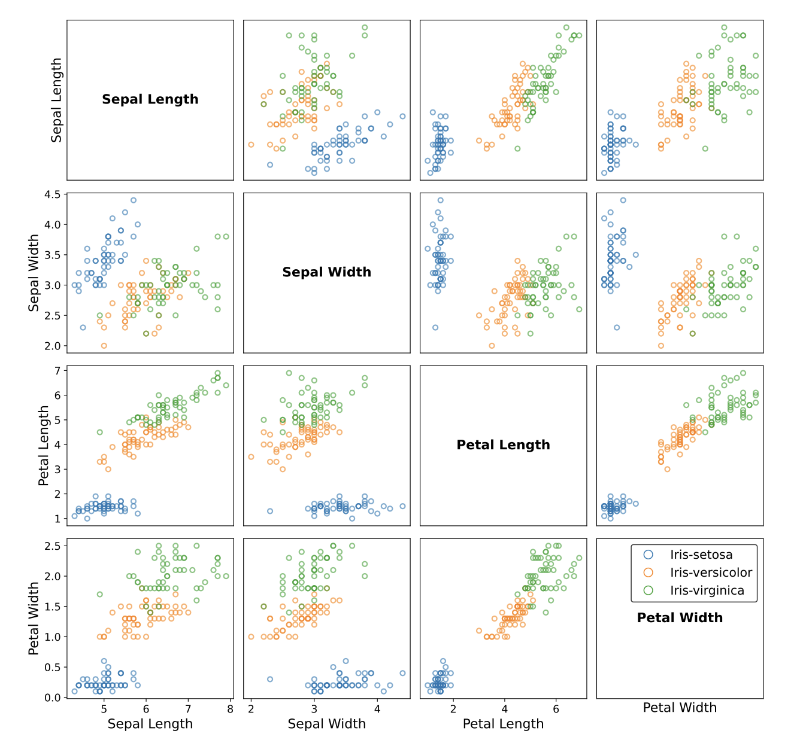

# Deep Function Learning Examples

## Before You Begin

This tab presents example code for using the {{our}} model to tackle various 
deep function learning tasks with the `tinybig` library. 

We assume you have already read the PRN paper and completed the provided tutorials, 
so we won't repeat technical information about model components. Instead, we'll provide runnable 
code and model configurations that directly address these deep function learning problems.

-------------------------

## Example Organization

The examples are organized according to the data modalities into different sections.

-   :material-function-variant:{ .middle } __Examples of Continuous Functions__

    ---
    Examples to use `tinybig` library for continuous function approximation.

    

    Examples include

    * Elementary function approximation
    * Composite function approximation
    * Feynman function approximation
    * etc.

    [:octicons-arrow-right-24: Get started](./function/index.md)

-   :fontawesome-regular-images:{ .lg .middle } __Examples of Vision Processing__

    ---
    Examples to use `tinybig` library for vision data processing.
    
    

    Examples include

    * MNIST hand-written digit classification
    * CIFAR10 image classification
    * etc.

    [:octicons-arrow-right-24: More information...](./image/index.md)

-   :fontawesome-solid-language:{ .lg .middle } __Examples of Language Processing__

    ---

    Examples to use `tinybig` library for language data processing.
    
    
    
    Examples include

    * IMDB review polarity classification
    * AGNews news topic inference
    * SST2 text sentiment prediction
    * etc.

    [:octicons-arrow-right-24: More information...](./text/index.md)

-   :fontawesome-solid-table:{ .lg .middle } __Examples of Tabular Processing__

    ---

    Examples to use `tinybig` library for tabular data processing.

    

    Examples include

    * Iris species prediction
    * Diabetes disease diagnosis 
    * Banknote authentication inference
    * etc.

    [:octicons-arrow-right-24: More information...](./tabular/index.md)

