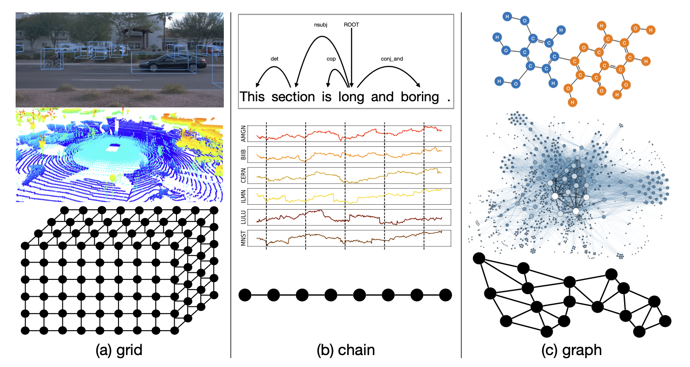
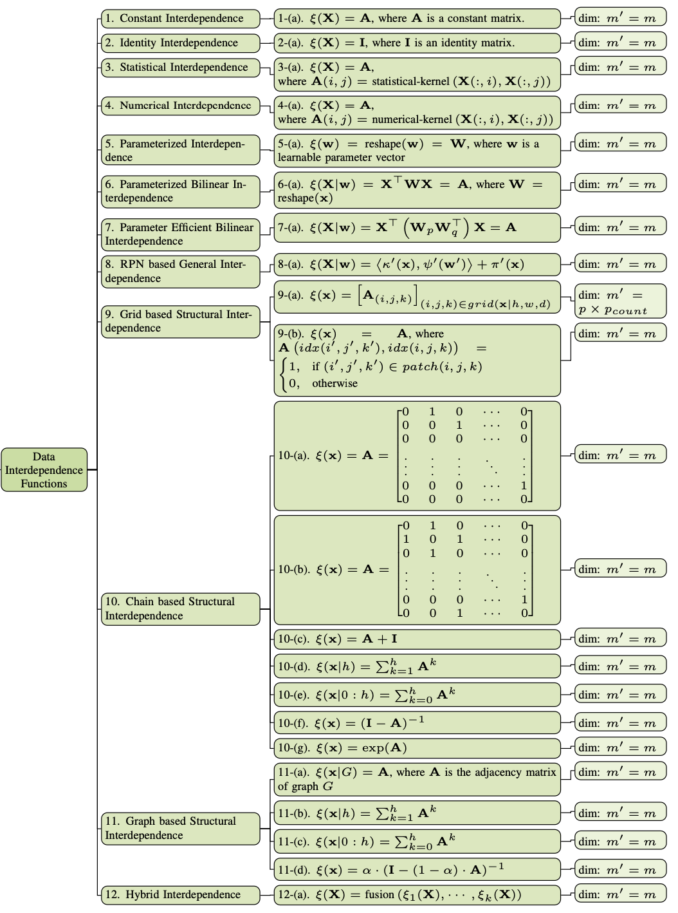
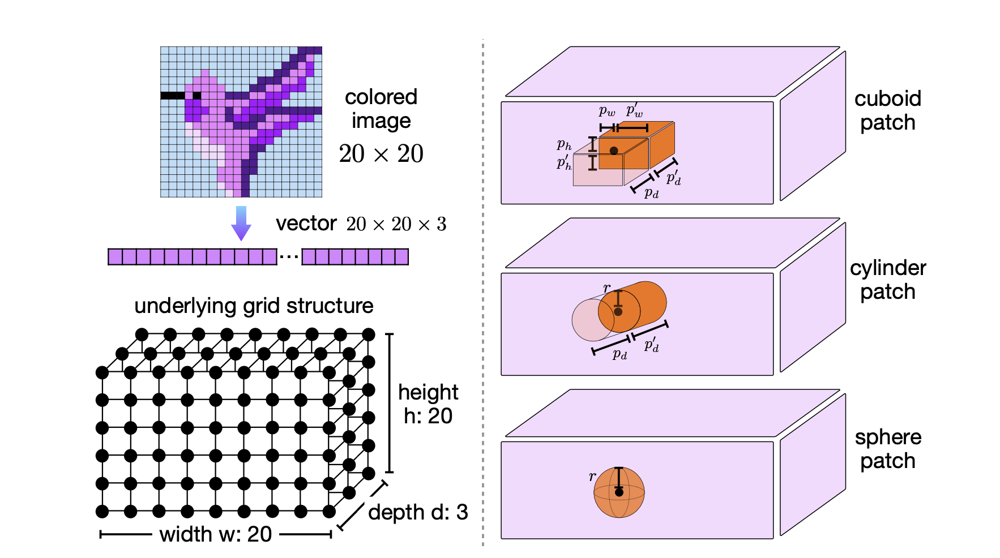
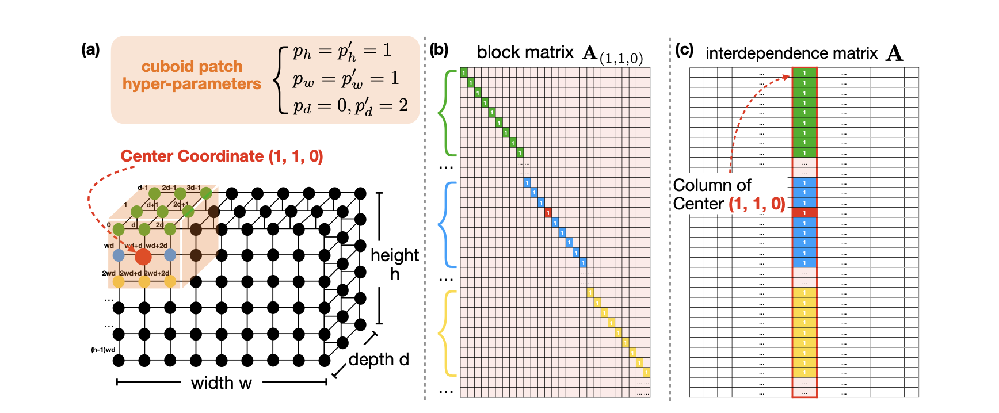
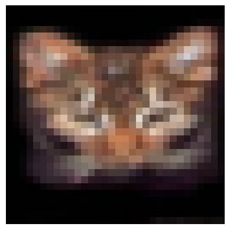
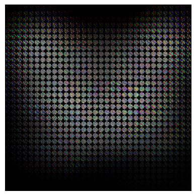
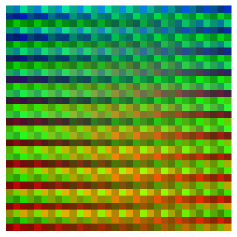

# Tutorial on Structural Interdependence Function

<div style="display: flex; justify-content: space-between;">
<span style="text-align: left;">
    Author: Jiawei Zhang <br>
    (Released: December 8, 2024; Latest Revision: December 10, 2024.)<br>
</span>
<span style="text-align: right;">

    <a href="https://github.com/jwzhanggy/tinyBIG/blob/main/docs/tutorials/beginner/module/code/structural_interdependence_tutorial.ipynb">
    
    </a>

    <a href="https://github.com/jwzhanggy/tinyBIG/blob/main/docs/tutorials/beginner/module/code/configs/structural_interdependence_function_config.yaml">
    
    </a>

    <a href="https://github.com/jwzhanggy/tinyBIG/blob/main/docs/tutorials/beginner/module/code/structural_interdependence_tutorial.py">
    
    </a>

</span>
</div>
----------------------------------------

In this tutorial, you will learn

* what is structural interdependence function,
* how to model structural interdependence in `tinybig`,
* how to calculate structural interdependence matrices,
* how to use the function to process image data.

Many materials used in this tutorial are prepared based on the Section 5.2 of `[2]`, and readers are also recommended to 
refer to that section of the paper for more detailed technical descriptions when you are working on this tutorial.

**References**:

`[2] Jiawei Zhang. RPN 2: On Interdependence Function Learning Towards Unifying and Advancing CNN, RNN, GNN, and Transformer. ArXiv abs/2411.11162 (2024).`

----------------------------------------

## 1. What is Structural Interdependence?



As the carrier of information, the data collected in different modalities usually have different underlying structures.
The above figure illustrates examples of real-world data and their corresponding topological structures. 
Images and point clouds can be represented as grids in 2D and 3D space; 
language and time series data exhibit chain structures with sequential connections; 
and molecule compounds and social networks can be represented as graphs. 

These diverse data types demonstrate various structural interdependence relationships among instances and attributes 
in terms of spatial distributions, sequential orders, and extensive interconnections, respectively.
It also motivates us to propose the **structural interdependence function** to be introduced below.


## 2. How to Model Structural Interdependence?

We propose to model the data structural interdependence relationships with the computational geometry and topology.
Computational geometry and topology are fields within computer science that focus on the study of algorithms expressible 
in terms of data geometry and topology structures. 
Both computational geometry and topology play fundamental roles in numerous areas of computer science and machine learning, 
with their algorithms being crucial for processing, analyzing, and interpreting data in geometric and topological forms.

Formally, given the input data batch $\mathbf{X} \in {R}^{b \times m}$ (with $b$ instances and each instance with $m$ attributes),
based on the underlying data topological/geometric structures, we compute the interdependence matrices modeling the interdependence 
relationships among instances and attributes in the data batch as follows:

\begin{equation}
\xi_a(\mathbf{X}) = \mathbf{A}_a \in {R}^{m \times m'} \text{, and }
\xi_i(\mathbf{X}) = \mathbf{A}_i \in {R}^{b \times b'},
\end{equation}

where $\mathbf{A}_a$ and $\mathbf{A}_i$ can capture the interdependence relationships among the attributes and instances, respectively.

## 3. Examples of Structural Interdependence Functions.

In the following figure (functions 9-11), we illustrate some example of the structural interdependence functions based on
the grid, chain and graph structures.
In the following parts of this tutorial, we will walk you through some of them to 
help you get familiar with these functions implemented in the `tinybig` library.



## 4. Geometric Grid based Structural Interdependence Function.

In this part, we will introduce the structural interdependence functions based on geometric patches present in input data batches with grid structures. 
These geometric patch-based data structural interdependence functions are primarily applied to model the interdependence relationships among attributes, 
such as pixels and voxels in images and point clouds. 
Additionally, in practical applications, they can also be utilized to model relationships among data instances with fixed grid-structured interdependence relationships.

### 4.1 Geometric Grid



Formally, given a data instance vector $\mathbf{x} \in R^{m}$, as illustrated in the above figure, 
we can represent its underlying 3D grid structure as an ordered list of coordinates denoting the attributes' locations in the grid:

\begin{equation}
grid(\mathbf{x} | h, w, d) = \left[ \left(i, j, k\right) \right]_{i \in \{0, 1, \cdots, h-1\}, j \in \{0, 1, \cdots, w-1\}, k \in \{0, 1, \cdots, d-1\}}.
\end{equation}

There exists an one-to-one mapping between the attributes in vector $\mathbf{x}$ and the coordinates in $grid(\mathbf{x} | h, w, d)$.
Given one coordinate index tuple $(i, j, k)$ from $grid(\mathbf{x} | h, w, d)$, its corresponding attribute index in vector $\mathbf{x}$ can be represented as:

\begin{equation}\label{equ:idx_calculation}
idx(i, j, k) = i \cdot w \cdot d + j \cdot d + k \in \{0, 1, 2, \cdots, m-1\},
\end{equation} 

for $\forall i \in \{0, 1, \cdots, h-1\}, j \in \{0, 1, \cdots, w-1\}, k \in \{0, 1, \cdots, d-1\}$.

The current `tinybig` library mainly focuses on cuboid-structured grids, which are prevalent as underlying structures of 
data instances in real-world applications, such as the aforementioned images and point clouds. 


### 4.2 Geometric Patch

A geometric patch denotes a small-sized, localized region in the input data instance's underlying grid structure.
As illustrated in by the plots in the above figure, the `tinybig` library allows patches of different shapes, 
such as **cuboid**, **cylinder**, and **sphere**.

#### 4.2.1 Cuboid Patch

Given a coordinate tuple $(i, j, k)$ in the grid, we can represent the patch, e.g., a cuboid with shape 
$(p_h, p_h'; p_w, p_w'; p_d, p_d')$, centered at $(i, j, k)$ as an ordered list of coordinate tuples:

\begin{equation}\label{equ:cuboid_patch}
patch(i, j, k) = \left[ \left( i+ \nabla i, j + \nabla j, k + \nabla k \right) \right]_{\nabla i \in [-p_h, p_h'], \nabla j \in [- p_w, p_w'], \nabla k \in [- p_d, p_d']},
\end{equation}

Its size is represented as $p = \left| patch(i, j, k) \right|$, denoting the number of coordinate tuples covered by the patch,
which equals to $(p_h + p_h' + 1) \times (p_w + p_w' + 1) \times (p_d + p_d' + 1)$.

#### 4.2.1 Cylinder and Sphere Patch

Similarly, we can represent cylinder patches of shape $(r; p_d, p_d')$ and sphere patches of shape $(r)$ centered at 
coordinates $(i, j, k)$ as follows:

\begin{equation}\label{equ:cylinder_sphere_patch}
\begin{aligned}
patch(i, j, k) &= \left[ \left( i+ \nabla i, j + \nabla j, k + \nabla k \right) \right]_{\nabla i, \nabla j \in [-r, r] \land \nabla i^2 + \nabla j^2 \le r^2, \nabla k \in [- p_d, p_d']},\\
patch(i, j, k) &= \left[ \left( i+ \nabla i, j + \nabla j, k + \nabla k \right) \right]_{\nabla i, \nabla j, \nabla k \in [-r, r] \land \nabla i^2 + \nabla j^2 + \nabla k^2 \le r^2},
\end{aligned}
\end{equation}

whose size can also be represented by the notation $p = \left| patch(i, j, k) \right|$ as well.

### 4.3 Geometric Grid based Structural Interdependence Function



Based on the provided grid structure of the input data batch and the defined patch shape (and size), 
we introduce the geometric patch-based structural interdependence function defined for input data instance 
$\mathbf{x} \in R^m$ as follows:

\begin{equation}\label{equ:patch_structural_interdependence_function}
\xi(\mathbf{x}) = \mathbf{A} \in R^{m \times m'}.
\end{equation}

As illustrated by the Plots (b) and (c), the function can work in both the **padding** and **aggregation** modes.

#### 4.3.1 Padding Mode

In the padding mode, the function composes matrix $\mathbf{A}$ as the concatenation of a 
sequence of block matrices $\mathbf{A}_{(i,j,k)} \in R^{m \times p}$ defined for each coordinate $(i, j, k) \in grid(\mathbf{x} | h, w, d)$:

\begin{equation}
\xi(\mathbf{x}) = \mathbf{A} = \left[ \mathbf{A}_{(i, j, k)} \right]_{(i,j,k) \in grid(\mathbf{x} | h, w, d)} \in R^{m \times m'}.
\end{equation}

The block sub-matrix $\mathbf{A}_{(i,j,k)}$ has $p$ columns, each corresponding to one of the coordinates in the $patch(i, j, k)$. 
For the column of coordinate $(i', j', k') \in patch(i, j, k)$, all entries in $\mathbf{A}_{(i,j,k)}$ are filled with zeros 
except those with index $idx(i', j', k')$, which is filled with value 1.

In the padding mode, the dimension $m'= (h \times w \times d) \times p = m \times p$, which is proportional to the sizes of both the grid and patches.

#### 4.3.2 Aggregation Mode 

In contrast, the interdependence matrix defined in the aggregation mode is considerably denser.
The filling pattern is determined by the coordinates encompassed by the patch centered at $(i, j, k) \in grid(\mathbf{x} | h, w, d)$, 
as follows:

\begin{equation}
\mathbf{A}\left( {idx(i',j',k'), idx(i,j,k)} \right) =
\begin{cases}
1, & \text{if } (i', j', k') \in patch(i, j, k) \\
0, & \text{otherwise}
\end{cases},
\end{equation}

In the aggregation mode, the matrix dimension $m'$ equals the size of the grid, i.e., $m' = m$, and is independent of the patch size.

### 4.4 An Example of the Structural Interdependence Function

Below, we will walk you through on how to define the geometric grid based structural interdependence function with the
cylinder patch shape to process the CIFAR-10 images.

We will start with the random seed setup. It is not a necessary step for this example actually, since the structural interdependence
function involves no learnable parameters.

```python linenums="1"
from tinybig.util import set_random_seed

random_seed = 123
set_random_seed(random_seed=random_seed)
```

In the `tinybig` library, we have provided the dataloader for the cifar-10 image dataset already. We will only use one
single image from the cifar-10 dataset. The code below will download the cifar-10 dataset to the "./data" folder in your current working directory.

```python linenums="1"
from tinybig.data import cifar10
import matplotlib.pyplot as plt

cifar10_data = cifar10(train_batch_size=1, test_batch_size=1)
data_loader = cifar10_data.load(cache_dir='./data/', with_transformation=False)
for x, y in data_loader['train_loader']:
    break
img = x[0]

img_to_show = img.permute(1, 2, 0)
plt.imshow(img_to_show)
plt.axis('off')  # optional, to hide the axis
plt.show()

img_flat = img.flatten()
print(img.shape, img_flat.shape)
```
???+ quote "CIFAR-10 raw image display"
    
    ```
    torch.Size([3, 32, 32]) torch.Size([3072])
    ```

#### 4.4.1 The Padding Mode

The cifar-10 image has shape of $32 \times 32 \times 3$, which has been flattened into a vector of length $3072$ before
being processed by the interdependence function. In this example, we define the interdependence function with cylinder
shapes with circular surface with a radius of $p_r = 4$ and the padding mode.

```python linenums="1"
from tinybig.koala.geometry import grid, cylinder
from tinybig.interdependence import geometric_interdependence

# radius of the cylinder circular surface
p_r = 4

dep_func = geometric_interdependence(
    name='geometric_interdependence',
    interdependence_type='attribute',
    grid=grid(h=32, w=32, d=1, universe_num=3),
    patch=cylinder(p_r=p_r, p_d=0, p_d_prime=0),
    packing_strategy='densest_packing',
    interdependence_matrix_mode='padding',
)

p = dep_func.get_patch_size()
m_prime = dep_func.calculate_m_prime()
print('patch_size: ', p, '; m_prime: ', m_prime)

A = dep_func.calculate_A()
print('interdependence matrix A shape: ', A.shape)

xi_x = dep_func(x=img_flat.unsqueeze(0)).squeeze(0)
print('xi_x shape: ', xi_x.shape)
```
???+ quote "MNIST raw image display"
    ```
    patch_size:  49 ; m_prime:  150528
    interdependence matrix A shape:  torch.Size([1024, 50176])
    xi_x shape:  torch.Size([150528])
    ```

The `tinybig.koala.geometry.grid` class allows us to define the RGB channel as either the `depth` of the grid or as the 
`universe_num`, which denotes the number of parallel geometric space.
In the above function, we will use the `universe_num` to model the RGB channels. The function defined above will project 
each attribute (or each pixel) into a cylinder patch with $p_r=4$ and $p_d=p_d'=0$, whose output vector dimension will be
$150528$, i.e., $32 \times 32 \times 3 \times p$, where the cylinder patch size $p=49$ in this example.

To visualize the output vector as a square image, we will introduce a function to project each patch into cylinder shape
enclosed in a cuboid structure, which will be organized into a image shape with RGB channels for visualization.

```python linenums="1"
import torch

def reshape_to_circle(arr, center_x=4, center_y=4, radius=4, square_size=9):
    if len(arr) != 49:
        raise ValueError("Input array must have exactly 49 values.")

    # Initialize a square with zeros
    square = torch.zeros((square_size, square_size))

    # Generate coordinates covered by the circle
    circle_coords = []
    for x in range(center_x - radius, center_x + radius + 1):
        for y in range(center_y - radius, center_y + radius + 1):
            if (x - center_x) ** 2 + (y - center_y) ** 2 <= radius ** 2:
                circle_coords.append((x, y))

    # Place values from `arr` into these coordinates
    for i, (x, y) in enumerate(circle_coords):
        square[x, y] = arr[i]

    return square
```

Based on the above function, we can visualize the processed image with necessary reshaping steps as follows.

```python linenums="1"
import torch
import matplotlib.pyplot as plt

# the padding mode will reorder the channel to the last dimension, which is permuted below.

xi_x = xi_x.reshape(32, 32, 49, 3).permute(0, 1, 3, 2)

reshaped_tensor = torch.zeros((32, 32, 3, 9, 9))
for i in range(32):
    for j in range(32):
        for k in range(3):
            reshaped_tensor[i, j, k] = reshape_to_circle(xi_x[i, j, k])

reshaped_tensor = reshaped_tensor.permute(0, 3, 1, 4, 2).reshape(32*9, 32*9, 3)

plt.imshow(reshaped_tensor)
plt.axis('off')
plt.show()
```
???+ quote "CIFAR-10 processed image display"
    

#### 4.4.2 The Aggregation Mode

We also illustrate the structural interdependence function with the `aggregation` mode for processing the image data.

```python linenums="1"
from tinybig.koala.geometry import grid, cylinder
from tinybig.interdependence import geometric_interdependence

# radius of the cylinder circular surface
p_r = 4

dep_func = geometric_interdependence(
    name='geometric_interdependence',
    interdependence_type='attribute',
    grid=grid(h=32, w=32, d=1, universe_num=3),
    patch=cylinder(p_r=p_r, p_d=0, p_d_prime=0),
    packing_strategy='densest_packing',
    interdependence_matrix_mode='aggregation',
)

p = dep_func.get_patch_size()
m_prime = dep_func.calculate_m_prime()
print('patch_size: ', p, '; m_prime: ', m_prime)

A = dep_func.calculate_A()
print('interdependence matrix A shape: ', A.shape)

xi_x = dep_func(x=img_flat.unsqueeze(0)).squeeze(0)
print('xi_x shape: ', xi_x.shape)
```
???+ quote "MNIST raw image display"
    ```
    patch_size:  49 ; m_prime:  3072
    interdependence matrix A shape:  torch.Size([1024, 1024])
    xi_x shape:  torch.Size([3072])
    ```

The processed image has the identical size as the input raw image, which is visualized below.

```python linenums="1"
import matplotlib.pyplot as plt

img = xi_x.reshape(3, 32, 32)

# the aggregation mode will create values outside the range, we will process it below.
img = img - img.min()
img = img / img.max()

img_to_show = img.permute(1, 2, 0)
plt.imshow(img_to_show)
plt.axis('off')  # optional, to hide the axis
plt.show()
```
???+ quote "CIFAR-10 processed image display"
    

## 5. Structural Interdependence Function instantiation from Configs.

Similar as the regular data interdependence functions, the above geometric grid based interdependence function can also
be initialized from the configuration files as well.

Please save the following `structural_interdependence_function_config.yaml` to the directory `./configs/` that your code can access:

=== "Interdependence Function in Python"
    ```python linenums="1"
    from tinybig.util import set_random_seed
    
    random_seed = 42
    set_random_seed(random_seed=random_seed)
    
    from tinybig.data import cifar10
    
    cifar10_data = cifar10(train_batch_size=1, test_batch_size=1)
    data_loader = cifar10_data.load(cache_dir='./data/', with_transformation=False)
    for x, y in data_loader['train_loader']:
        break
    img = x[0]
    
    img_flat = img.flatten()
    print(img.shape, img_flat.shape)
    
    from tinybig.config.base_config import config
    
    config_obj = config(name='structural_interdependence_function_config')
    func_configs = config_obj.load_yaml(cache_dir='./configs', config_file='structural_interdependence_function_config.yaml')
    
    dep_func = config.instantiation_from_configs(
        configs=func_configs['data_interdependence_function_configs'], 
        class_name='data_interdependence_function_class', 
        parameter_name='data_interdependence_function_parameters'
    )
    
    m_prime = dep_func.calculate_m_prime()
    A = dep_func.calculate_A()
    xi_x = dep_func(x=img_flat.unsqueeze(0)).squeeze(0)
    
    print('m_prime:', m_prime)
    print('attribute_A:', A.shape)
    print('attribute_xi_X:', xi_x.shape)
    ```

=== "./configs/structural_interdependence_function_config.yaml"
    ```yaml linenums="1"
    data_interdependence_function_configs:
      data_interdependence_function_class: tinybig.interdependence.geometric_interdependence
      data_interdependence_function_parameters:
        name: geometric_interdependence
        interdependence_type: attribute
        h: 32
        w: 32
        channel_num: 3
        patch_configs:
          patch_class: tinybig.koala.geometry.cylinder
          patch_parameters:
            p_r: 4
            p_d: 0
        packing_strategy: densest_packing
        interdependence_matrix_mode: padding
        require_parameters: False
        require_data: False
        device: cpu
    ```
???+ quote "Interdependence function instantiation from Configs"
    ```
    torch.Size([3, 32, 32]) torch.Size([3072])
    m_prime: 150528
    attribute_A: torch.Size([1024, 50176])
    attribute_xi_X: torch.Size([150528])
    ```

## 6. Conclusion.

In this tutorial, we introduced the structural interdependence functions for readers. These functions are introduced to
model the interdependence relationships based on the input data underlying modality specific structures, e.g., grid, chain and graph.
We have illustrated some examples of the structural interdependence functions in this tutorial.
What's more, we have also introduced how to define the geometric grid based interdependence function for processing the
image data with both the padding and aggregation modes.


