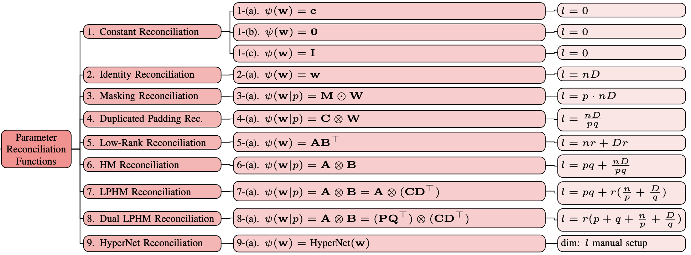

# Tutorial on Parameter Reconciliation Functions 

<div style="display: flex; justify-content: space-between;">
<span style="text-align: left;">
    Author: Jiawei Zhang <br>
    (Released: November 25, 2024; Latest Revision: November 28, 2024.)<br>
</span>
<span style="text-align: right;">

    <a href="https://github.com/jwzhanggy/tinyBIG/blob/main/docs/tutorials/beginner/module/code/reconciliation_tutorial.ipynb">
    
    </a>

    <a href="https://github.com/jwzhanggy/tinyBIG/blob/main/docs/tutorials/beginner/module/code/reconciliation_function_postprocessing.yaml">
    
    </a>

    <a href="https://github.com/jwzhanggy/tinyBIG/blob/main/docs/tutorials/beginner/module/code/reconciliation_tutorial.py">
    
    </a>

</span>
</div>
----------------------------------------

In this tutorial, you will learn

* what is parameter reconciliation function,
* how to do parameter reconciliation in `tinybig`,
* how to calculate required parameter numbers,
* and how to create reconciliation function from config.

Many materials used in this tutorial are prepared based on the Section 5.2 of `[1]`, and readers are also recommended to 
refer to that section of the paper for more detailed technical descriptions when you are working on this tutorial.

**References**:

`[1] Jiawei Zhang. RPN: Reconciled Polynomial Network. Towards Unifying PGMs, Kernel SVMs, MLP and KAN.`

----------------------------------------

## 1. What is Parameter Reconciliation Function?

**Parameter reconciliation function** is a component function used in the {{our}} for reconciling the model parameters
to accommodate the data expansion space and desired output space:

\begin{equation}
\psi: R^{l} \to R^{n \times D},
\end{equation}

where $l$ is the parameter number, $D$ and $n$ denotes the expansion space and output space dimensions, respectively.

The parameter reconciliation function $\psi$ adjusts the available parameter vector of length $l$ by fabricating 
a new parameter matrix of size $n \times D$ to accommodate the expansion space dimension $D$ defined by function $\kappa$. 

In most of the cases studied in this paper, the parameter vector length $l$ is much smaller than the output matrix size 
$n \times D$. Meanwhile, in practice, we can also define function $\psi$ to fabricate a longer parameter vector into 
a smaller parameter matrix, where $l > n \times D$.

To unify these different cases, the data reconciliation function can also be referred to as the parameter fabrication function, 
and these function names will be used interchangeably in the `tinybig` library.

## 2. Examples of Parameter Reconciliation Functions?

In the `tinybig` library, several different families of parameter reconciliation functions have been implemented, whose detailed information
is also available at the reconciliation function [documentation pages](../../../documentations/reconciliation/index.md).

In the following figure, we illustrate some example of them, including their names, formulas, and the corresponding 
parameter number calculations. In the following parts of this tutorial, we will walk you through some of them to 
help you get familiar with some of these functions implemented in the `tinybig` library.



## 3. Basic Parameter Reconciliation Functions.

Below, we will introduce different parameter reconciliation functions to fabricate a parameter matrix of shape $n \times D$,
where $n=6$ and $D=12$.

### 3.1 Identity Parameter Reconciliation Function.

Given a parameter vector $\mathbf{w} \in R^l$ of length $l$, the **identity parameter reconciliation function** will 
fabricate vector $\mathbf{w}$ into a parameter matrix $\mathbf{W} \in R^{n \times D}$ of shape $n \times D$ 
via reshaping operator as follows:

\begin{equation}
\psi(\mathbf{w}) = \text{reshape}(\mathbf{w}) = \mathbf{W} \in R^{n \times D}.
\end{equation}

In real practice, given the desired output parameter matrix shape $n \times D$, the reconciliation functions implemented
in the `tinybig` library will calculate the required parameter vector length $l$ automatically.

```python linenums="1"
import torch
from tinybig.reconciliation import identity_reconciliation

rec_func = identity_reconciliation(name='identity_reconciliation')

n, D = 6, 12
l = rec_func.calculate_l(n=n, D=D)
print('n:', n, '; D:', D, '; l:', l)

w = torch.nn.Parameter(torch.randn(1, l), requires_grad=True)
W = rec_func(w=w, n=n, D=D)

print("w vector shape:", w.shape, "; W matrix shape:", W.shape)
```
???+ quote "Identity reconciliation printing output"
    ```
    n: 6 D: 12 l: 72

    w vector shape: torch.Size([1, 72]) ; W matrix shape: torch.Size([6, 12])
    ```

### 3.2 Duplicated Padding Reconciliation Function.

To reduce the number of required parameters, the **duplicated padding reconciliation function** will sequentially pad
a small-sized parameter vector $\mathbf{w} \in {R}^l$ (or its reshaped small-sized matrix $\mathbf{W} \in R^{s \times t}$, where $l = s \times t$) 
to create a large-sized parameter matrix $\mathbf{W}$ of shape $n \times D$ as follows:

\begin{equation}
\psi(\mathbf{w}) = \mathbf{C} \otimes \mathbf{W} = \begin{bmatrix}
C_{1,1} \mathbf{W} & C_{1,2} \mathbf{W}      & \cdots & C_{1,q} \mathbf{W}      \\
C_{2,1} \mathbf{W} & C_{2,2} \mathbf{W}      & \cdots & C_{2,q} \mathbf{W}      \\
\vdots & \vdots & \ddots & \vdots \\
C_{p,1} \mathbf{W} & C_{p,2} \mathbf{W}      & \cdots & C_{p,q} \mathbf{W}      \\
\end{bmatrix} \in {R}^{ps \times qt},
\end{equation}

where $\mathbf{C} \in R^{p \times q}$ denotes a constant matrix with $C_{i,j} = 1$ by default in the 
current `tinybig` library implementation. 

In real practice, the size of $\mathbf{C}$, i.e., $p$ and $q$, may require manual setups, which
have the constraint that $n = p \times s$, $D = q \times t$ and $l = s \times t$.

```python linenums="1"
import torch
from tinybig.reconciliation import duplicated_padding_reconciliation

p, q = 2, 2
rec_func = duplicated_padding_reconciliation(name='duplicated_padding_reconciliation', p=p, q=q)

n, D = 6, 12
l = rec_func.calculate_l(n=n, D=D)
print('n:', n, '; D:', D, '; l:', l)

w = torch.nn.Parameter(torch.randn(1, l), requires_grad=True)
W = rec_func(w=w, n=n, D=D)

print("w vector shape:", w.shape, "; W matrix shape:", W.shape)
```
???+ quote "Identity reconciliation printing output"
    ```
    n: 6 ; D: 12 ; l: 18
    
    w vector shape: torch.Size([1, 18]) ; W matrix shape: torch.Size([6, 12])
    ```

The above code will fabricate a small parameter vector of length $18$ (or a parameter matrix of shape $3 \times 4$) into
a matrix of shape $6 \times 12$ by duplicating twice in both the row and column dimensions, i.e., $p=2$ and $q=2$.

## 4. Advanced Parameter Reconciliation Functions. 

In addition to the above basic parameter reconciliation functions, in this section, we will introduce several more efficient
parameter reconciliation methods, which can fabricate an even smaller-length parameter vector into the desired shape.

### 4.1 Low-Rank Reconciliation Function.

Given the parameter vector $\mathbf{w} \in {R}^{l}$ and a rank hyper-parameter $r$, the **low-rank parameter reconciliation function**
will partition $\mathbf{w}$ into two sub-vectors and subsequently reshape them into two matrices $\mathbf{A} \in {R}^{n \times r}$ 
and $\mathbf{B} \in {R}^{D \times r}$, each possessing a rank of $r$. 

These two sub-matrices $\mathbf{A}$ and $\mathbf{B}$ help define the low-rank reconciliation function as follows:

\begin{equation}
\psi(\mathbf{w}) = \mathbf{A} \mathbf{B}^\top \in {R}^{n \times D}.
\end{equation}

For instance, following the above examples, we can also fabricate their desired parameter matrix with shape $6 \times 12$
with the low-rank reconciliation function with rank $r=1$ as follows:

```python linenums="1"
import torch
from tinybig.reconciliation import lorr_reconciliation

r = 1
rec_func = lorr_reconciliation(name='lorr_reconciliation', r=r)

n, D = 6, 12
l = rec_func.calculate_l(n=n, D=D)
print('n:', n, '; D:', D, '; l:', l)

w = torch.nn.Parameter(torch.randn(1, l), requires_grad=True)
W = rec_func(w=w, n=n, D=D)

print("w vector shape:", w.shape, "; W matrix shape:", W.shape)
```
???+ quote "Identity reconciliation printing output"
    ```
    n: 6 ; D: 12 ; l: 18

    w vector shape: torch.Size([1, 18]) ; W matrix shape: torch.Size([6, 12])
    ```

### 4.2 HM Reconciliation Function.

The **Hypercomplex Multiplication (HM)-based reconciliation function** applies the Kronecker product operator to two
parameter sub-matrices partitioned and reshaped from the parameter vector $\mathbf{w} \in R^l$ as follows:

\begin{equation}
\psi(\mathbf{w}) = \mathbf{A} \otimes \mathbf{B} \in {R}^{n \times D}.
\end{equation}

Both matrices $\mathbf{A}$ and $\mathbf{B}$ are derived from the parameter vector $\mathbf{w}$ through partitioning 
and subsequent reshaping.

In implementation, to reduce the number of hyper-parameters and accommodate the parameter dimensions, we can setup 
the size of matrix $\mathbf{A}$ as fixed by two hyper-parameters $p$ and $q$, i.e., $\mathbf{A} \in {R}^{p \times q}$. 
Subsequently, the desired size of matrix $\mathbf{B}$ can be directly calculated as $s \times t$, 
where $s =\frac{n}{p}$ and $t = \frac{D}{q}$. 

`tinybig` allows manual setups of the hyper-parameters $p$ and $q$ and users may need to manually maintain the constraints 
$n = p \times s$, $D = q \times t$ and $l = s \times t$.

```python linenums="1"
import torch
from tinybig.reconciliation import hm_reconciliation

p, q = 2, 2
rec_func_manual = hm_reconciliation(name='hm_reconciliation', p=p, q=q)

n, D = 6, 12
l = rec_func_manual.calculate_l(n=n, D=D)
print('n:', n, '; D:', D, '; l:', l)

w = torch.nn.Parameter(torch.randn(1, l), requires_grad=True)
W = rec_func_manual(w=w, n=n, D=D)

print("w vector shape:", w.shape, "; W matrix shape:", W.shape)
```
???+ quote "Identity reconciliation printing output"
    ```
    n: 6 ; D: 12 ; l: 22

    w vector shape: torch.Size([1, 22]) ; W matrix shape: torch.Size([6, 12])
    ```

Besides manual setups, if the hyper-parameters $p$ and $q$ are not provided, `tinybig` can also automatically find the
integers that are closet to the square roots of $n$ and $D$ for $p$ and $q$ (with the `tinybig.koala.algebra.find_close_factors` method), 
i.e., $p = floor(\sqrt{n})$ and $q = floor(\sqrt{D})$, which will lead to a smaller length $l$.

```python linenums="1"
import torch
from tinybig.reconciliation import hm_reconciliation

rec_func_auto = hm_reconciliation(name='hm_reconciliation')

n, D = 6, 12
l = rec_func_auto.calculate_l(n=n, D=D)
print('n:', n, '; D:', D, '; l:', l)

w = torch.nn.Parameter(torch.randn(1, l), requires_grad=True)
W = rec_func_auto(w=w, n=n, D=D)

print("w vector shape:", w.shape, "; W matrix shape:", W.shape)
```
???+ quote "Identity reconciliation printing output"
    ```
    n: 6 ; D: 12 ; l: 18

    w vector shape: torch.Size([1, 18]) ; W matrix shape: torch.Size([6, 12])
    ```

The above code will set $p=2$ and $q=3$, which will use $l=18$ parameters for the fabrication.

### 4.3 LPHM Reconciliation Function.

To further reduce the number of required parameters, the **LPHM reconciliation function** proposes to fabricate the
sub-matrix $\mathbf{B}$ used in the above HM reconciliation function into its low-rank representation instead, i.e.,

\begin{equation}
\psi(\mathbf{w}) = \mathbf{A} \otimes \mathbf{B} = \mathbf{A} \otimes ( \mathbf{S} \mathbf{T}^\top) \in {R}^{n \times D},
\end{equation}

where $\mathbf{A} \in {R}^{p \times q}$, and $\mathbf{S} \in {R}^{\frac{n}{p} \times r}$ and $\mathbf{T} \in {R}^{\frac{D}{q} \times r}$ 
represent the low-rank matrices for composing $\mathbf{B}$.

Similar as the above, in real practice, `tinybig` allows either manual or automatic setups of the hyper-parameter $p$ and $q$.
Below, we will present the automatic hyper-parameter setups with rank $r=1$, which will further reduce the number of required
parameters for the reconciliation function.

```python linenums="1"
import torch
from tinybig.reconciliation import lphm_reconciliation

r = 1
rec_func_auto = lphm_reconciliation(name='lphm_reconciliation', r=r)

n, D = 6, 12
l = rec_func_auto.calculate_l(n=n, D=D)
print('n:', n, '; D:', D, '; l:', l)

w = torch.nn.Parameter(torch.randn(1, l), requires_grad=True)
W = rec_func_auto(w=w, n=n, D=D)

print("w vector shape:", w.shape, "; W matrix shape:", W.shape)
```
???+ quote "Identity reconciliation printing output"
    ```
    n: 6 ; D: 12 ; l: 13

    w vector shape: torch.Size([1, 13]) ; W matrix shape: torch.Size([6, 12])
    ```

The function will automatically identify $p=2$ and $q=3$, and the number of required parameter for the function will be
$l = p \times q + r( \frac{n}{p} + \frac{D}{q} ) = 2 \times 3 + 1 \times (\frac{6}{2} + \frac{12}{3}) = 13$.

### 4.4 Dual-LPHM Reconciliation Function.

The **Dual-LPHM reconciliation function** applies the low-rank fabrication to both the $\mathbf{A}$ and $\mathbf{B}$ matrices
in the HM reconciliation function:

\begin{equation}
\psi(\mathbf{w}) = \mathbf{A} \otimes \mathbf{B} = ( \mathbf{P} \mathbf{Q}^\top) \otimes ( \mathbf{S} \mathbf{T}^\top) \in {R}^{n \times D},
\end{equation}

where $\mathbf{P} \in {R}^{p \times r}$ and $\mathbf{Q} \in {R}^{q \times r}$ represent the low-rank matrices for composing $\mathbf{A}$, 
and $\mathbf{S} \in {R}^{\frac{n}{p} \times r}$ and $\mathbf{T} \in {R}^{\frac{D}{q} \times r}$ represent the low-rank matrices for composing $\mathbf{B}$.

```python linenums="1"
import torch
from tinybig.reconciliation import dual_lphm_reconciliation

r = 1
rec_func_auto = dual_lphm_reconciliation(name='dual_lphm_reconciliation', r=r)

n, D = 6, 12
l = rec_func_auto.calculate_l(n=n, D=D)
print('n:', n, '; D:', D, '; l:', l)

w = torch.nn.Parameter(torch.randn(1, l), requires_grad=True)
W = rec_func_auto(w=w, n=n, D=D)

print("w vector shape:", w.shape, "; W matrix shape:", W.shape)
```
???+ quote "Identity reconciliation printing output"
    ```
    n: 6 ; D: 12 ; l: 12

    w vector shape: torch.Size([1, 12]) ; W matrix shape: torch.Size([6, 12])
    ```

## Reconciliation Function from Configs

Besides the above manual function definitions, we will also briefly introduce how to instantiate the 
reconciliation function instances from their configurations.

For instance, for the Dual LPHM reconciliation function introduced above, it can also be equivalently represented and
instantiated with the following configs

```python linenums="1"
import torch
from tinybig.config.base_config import config

parameter_reconciliation_configs = {
    'parameter_reconciliation_class': 'tinybig.reconciliation.dual_lphm_reconciliation',
    'parameter_reconciliation_parameters': {
        'name': 'dual_lphm_reconciliation',
        'p': 2,
        'q': 3,
        'r': 1,
    }
}

rec_func = config.get_obj_from_str(parameter_reconciliation_configs['parameter_reconciliation_class'])(**parameter_reconciliation_configs['parameter_reconciliation_parameters'])

n, D = 6, 12
l = rec_func.calculate_l(n=n, D=D)
print('n:', n, '; D:', D, '; l:', l)

w = torch.nn.Parameter(torch.randn(1, l), requires_grad=True)
W = rec_func(w=w, n=n, D=D)

print("w vector shape:", w.shape, "; W matrix shape:", W.shape)
```

`tinybig` provides several different ways to define and instantiate functions from their configs. Besides the above example,
we can also instantiate the function with the `tinybig.config.config.instantiation_from_configs` method

```python linenums="1"
from tinybig.config.base_config import config

parameter_reconciliation_configs = {
    'parameter_reconciliation_class': 'tinybig.reconciliation.dual_lphm_reconciliation',
    'parameter_reconciliation_parameters': {
        'name': 'dual_lphm_reconciliation',
        'p': 2,
        'q': 3,
        'r': 1,
    }
}

rec_func = config.instantiation_from_configs(configs=parameter_reconciliation_configs, class_name='parameter_reconciliation_class', parameter_name='parameter_reconciliation_parameters')
```

For some complex function configs, we can also save the configuration detailed information into a file, which can be loaded
for the function instantiation.

Please save the following `reconciliation_function_config.yaml` to the directory `./configs/` that your code can access:

=== "Expansion Function in Python"
    ```python linenums="1"
    import torch
    from tinybig.config.base_config import config
    
    config_obj = config(name='dual_lphm_reconciliation_function_config')
    func_configs = config_obj.load_yaml(cache_dir='./configs', config_file='reconciliation_function_config.yaml')
    
    rec_func = config.instantiation_from_configs(configs=parameter_reconciliation_configs, class_name='parameter_reconciliation_class', parameter_name='parameter_reconciliation_parameters')
    
    n, D = 6, 12
    l = rec_func.calculate_l(n=n, D=D)
    print('n:', n, '; D:', D, '; l:', l)
    
    w = torch.nn.Parameter(torch.randn(1, l), requires_grad=True)
    W = rec_func(w=w, n=n, D=D)
    
    print("w vector shape:", w.shape, "; W matrix shape:", W.shape)
    ```

=== "./configs/expansion_function_postprocessing.yaml"
    ```yaml linenums="1"
    parameter_reconciliation_configs:
      parameter_reconciliation_class: tinybig.reconciliation.dual_lphm_reconciliation
      parameter_reconciliation_parameters:
        name: dual_lphm_reconciliation
        p: 2
        q: 3
        r: 1
        require_parameters: True
        enable_bias: True
        device: cpu
    ```
???+ quote "Taylor's expansion with post-processing sigmoid and layer-norm"
    ```
    n: 6 ; D: 12 ; l: 12
    
    w vector shape: torch.Size([1, 12]) ; W matrix shape: torch.Size([6, 12])
    ```
