---------------

## 文章标题

### RPN: Reconciled Polynomial Network Towards Unifying PGMs, Kernel SVMs, MLP and KAN

## 文章, 网站, 和源码链接

* **RPN Paper**: [https://arxiv.org/abs/2407.04819](https://arxiv.org/abs/2407.04819)
* **Official Website**: [https://www.tinybig.org/](https://www.tinybig.org/)
* **Github Repository**: [https://github.com/jwzhanggy/tinyBIG](https://github.com/jwzhanggy/tinyBIG)
* **PyPI Package**: [https://pypi.org/project/tinybig/](https://pypi.org/project/tinybig/)

## 背景介绍

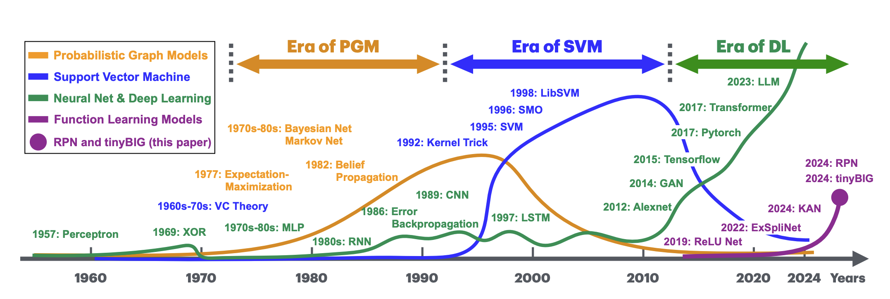

在过去的70年里，人工智能领域在研究的问题和使用的模型方面都经历了巨大的变化。随着新学习任务的出现，各种基于不同先验假设的机器学习模型被提出以解决这些问题。

在上图中，我们展示了过去50年里主导人工智能领域的三种类型的机器学习模型，包括概率图模型、支持向量机、和深度神经网络。
随着技术上的重要突破，这些模型各自有其辉煌时期，并在当今的数据科学和机器学习相关的各种研究和应用任务中得到了广泛的探索和利用。

区别于以往的基础机器学习模型，在本文中，我们提出了**Function Learning Task**这个概念。
具体来说， **Function Learning Task**这个任务名称中提到的“**Function**”不仅指构成我们提出的 **RPN** 模型中的**Component Functions**，还指我们提出的模型作为智能系统将输入信号与期望输出响应关联的**Cognitive Functions**。
长期以来，**Function Learning** 基本被简单等同于连续函数拟合和回归任务。但其实在心理学和认知科学中，研究者们也使用**Function Learning**的概念来模拟人类和其他智能主体的刺激-反应关系的心理诱导过程，其过程涉及知识获取、信息处理和推理等一系列复杂的过程。

在本文中，**Function Learning** 被视为是智能模型学习中最基本的任务，涵盖了基于多模态数据的多种学习任务，包括但不限于：

* 连续函数近似
* 离散视觉和语言数据的识别与预测
* 认知和逻辑依赖关系的归纳
* 等其他任务

## RPN 模型结构

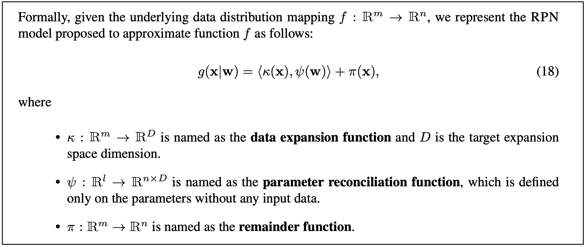

为了解决上面提到的**Function Learning**包括的各种复杂任务，本文将介绍一种新型深度函数学习模型 (deep function learning)，即 “**Reconciled Polynomial Network**" (**RPN**).

在模型架构方面，如上图所示，**RPN** 由三个组成函数构成：**数据扩展函数(data expansion function）**、**参数调和函数(parameter reconciliation function)**、和**余项函数(remainder function)**。
受泰勒定理启发，RPN 将输入数据与模型参数分离，并将目标函数近似为数据扩展函数与参数调和函数的内积，然后加上余项函数。

* **数据扩展函数**：根据数据扩展函数的定义，RPN将数据向量从输入空间投射到中间隐层（更高维度）空间，投射后的数据将由新空间中的新的基向量表示。
* **参数调和函数**：为了应对数据扩展带来的“维度灾难”问题，RPN中的参数调和函数将一组减少的参数合成为一个高阶参数矩阵。 这些扩展的数据向量通过与这些生成的调和参数的内积进行多项式集成，从而将这些扩展的数据向量投射回所需的低维输出空间。
* **余项函数**：此外，余数函数为RPN提供了额外的补充信息，以进一步减少潜在的近似误差。

相比现有的深度学习模型，RPN中的所有组成函数都具有具体的物理意义。这些函数与简单内积和求和操作的直接应用相结合，使RPN相比于其他现有基础模型具有更大的可解释性。

## 具有“广度”和“深度” 的 RPN 模型结构

RPN拥有高度灵活的架构，能够构建具有不同复杂性、容量和完整度的模型。本文中，为了在设计上提供更大的建模能力，我们通过结合多头（Multi-Head）、多通道（Multi-Channel）、以及多层（Multi-Layer)的基础结构，来构造兼具“广度”和“深度”的 RPN 模型架构：

* **广度模型结构**：RPN 提供了 Multi-Channel 和 Multi-Head 的模型结构构建机制，允许用户扩展模型的广度，使得模型能够有更加广泛的数据扩展能力和更大的模型容量。
* **深度模型结构**：RPN 也提供了 Multi-Layer 的模型结构构建机制，允许用户构建多层的深度模型结构，使得模型能够通过多层函数嵌套变换，能够学习更加复杂数据分布。

此外，如下图所示，我们还通过嵌套和扩展的数据扩展函数（extended and nested data expansion functions），
为构建具有类似上述“广度”和“深度”能力的 RPN 模型提供了更具适应性和轻量级的构造机制。

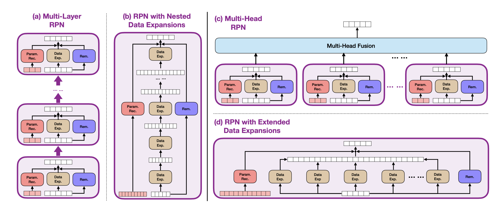

## RPN 功能函数列表

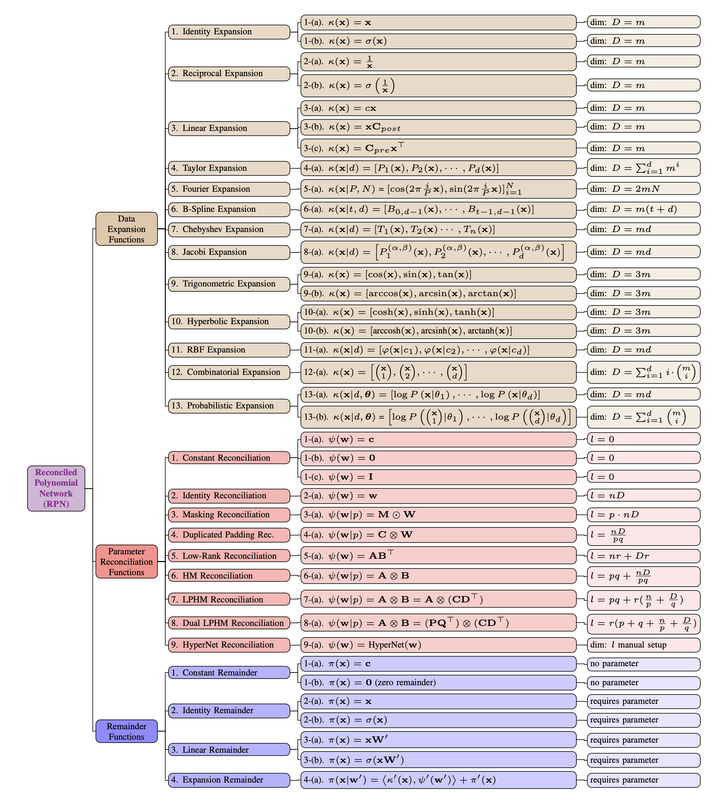

在本文中，我们引入了数据扩展函数、参数调和函数，和余项函数这三种组成函数，它们是RPN模型的构建模块。
通过有效地组合这些组成函数，我们可以构建一个多头、多通道和多层架构，使RPN能够应对广泛的学习挑战。

在本文中，我们提出了25类数据扩展函数、10类参数调和函数和5类余项函数，部分功能函数的表示和基本信息都总结在了上面的列表中。

## 基础模型的统一表示： PGM, kernels SVM, MLP 和 KAN

RPN实现了丰富的功能函数，具体列表如上图所示。 通过组合使用上述功能函数，RPN不仅可以构建功能强大的模型结构，
并且可以统一现有基础模型的表示，包括 PGMs, kernel SVM, MLP 和最近的 KAN。

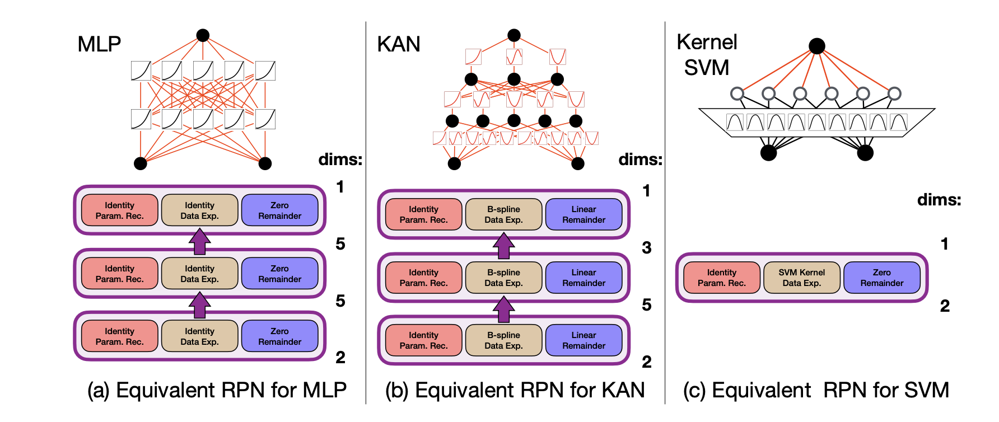

## 实验验证

为了验证提出的RPN模型的有效性，本文通过大量的实验结果和分析，证明了 RPN 在多种**Function Learning Task**上的有效性。
并且通过使用远远低于现有模型的参数量，RPN 就可以获得比现有模型更好的学习效果，这可以大大降低现有模型训练和测试时所需的计算时间和显存空间。

在本文中，具体的实验任务包括：连续函数拟合，离散图片和文本分类，以及概率关系预测等。

### 连续函数拟合

RPN 可以有效的拟合连续函数，本文提出和使用了三个连续函数数据集来测试 RN在连续函数拟合上的表现。我们使用了三类连续函数数据集，包括

* 基础函数（elementary function)
* 复合函数（composite function）
* 费曼函数（Feynman function).

如下图在费曼函数上的结果显示，在绝大多数的连续函数上 RPN 都可以获得比MLP和KAN至少低x10^{-1}甚至x10^{-2}的拟合误差。

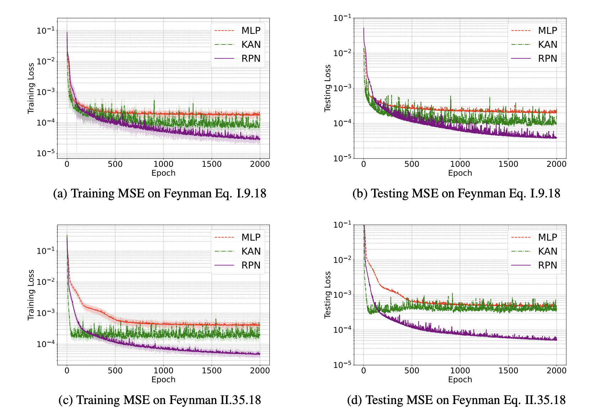

### 离散图片和文本分类

除了连续函数以外，我们也在离散图片和文本数据集上测试了RPN的实验效果，包括

* MNIST 图片数据集
* CIFAR10 图片数据集
* IMDB 文本数据集
* SST2 文本数据集
* AGNews 文本数据集

通过数据扩展函数(data expansion function），RPN可以把输入的数据扩展到更高维度的空间，如下图所示：

在扩展空间中，RPN通过参数调和函数(parameter reconciliation function)可以使用更少的科学系变量来获得更好的学习效果，部分结果如下图所示：

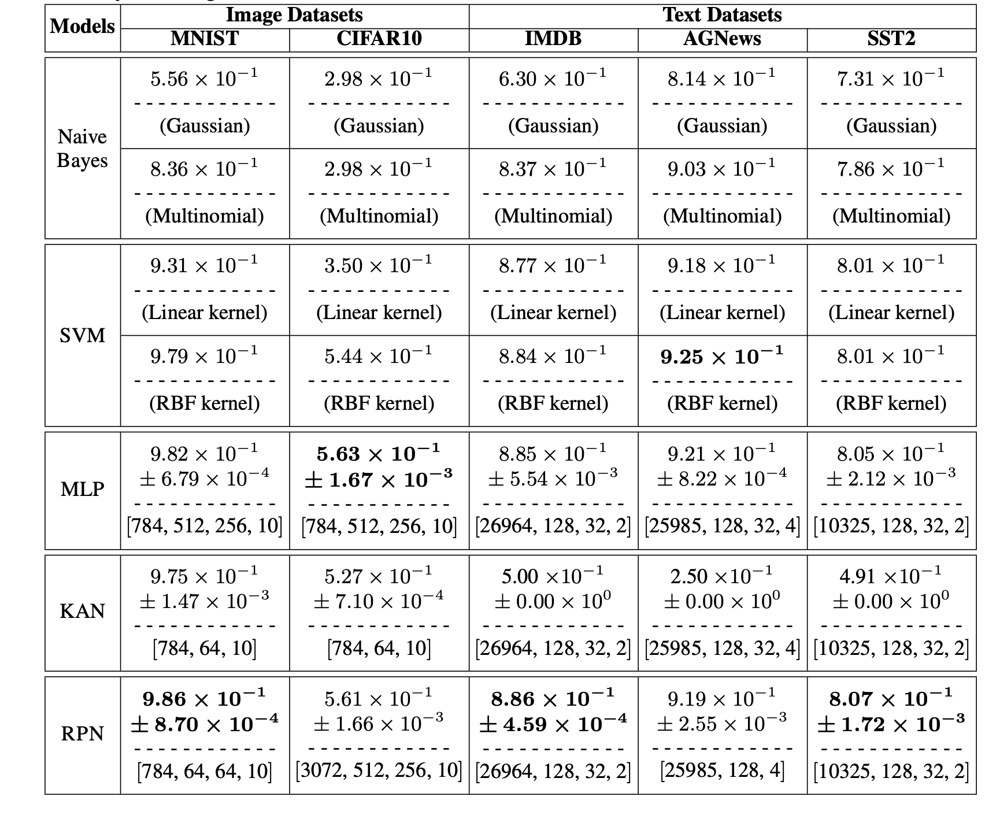

### 概率关系预测

除上面结果之外，通过使用概率数据扩展函数(probabilistic data expansion function），RPN也可以有效的预测输入数据变量之间的依赖关系，其可以
有效的增强 RPN 在概率和统计方面的可解释性。

我们在几个传统的 tabular 数据集上测试了 RPN 在概率关系预测上的表现，其中数据集包括

* Iris Species 数据集
* Pima Indians Diabetes 数据集
* Banknote Authentication 数据集

下图我们展示了 RPN 在 Iris 数据集上预测出来的变量依赖关系的图示。相比其他概率模型，RPN 预测出来的变量依赖关系更加符合现实情况：

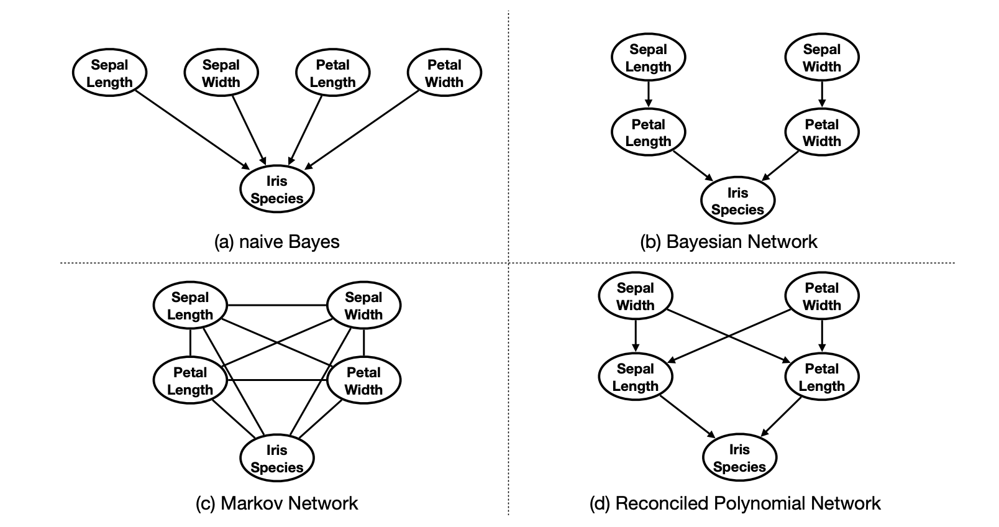

## RPN 的解释性和构造动机

本文也通过从“机器学习”和“生物神经科学”等多个角度讨论我们 RPN 模型设计的解释。通过这些讨论，我们旨在阐明 RPN 模型设计的动机和优势。

### 机器学习角度

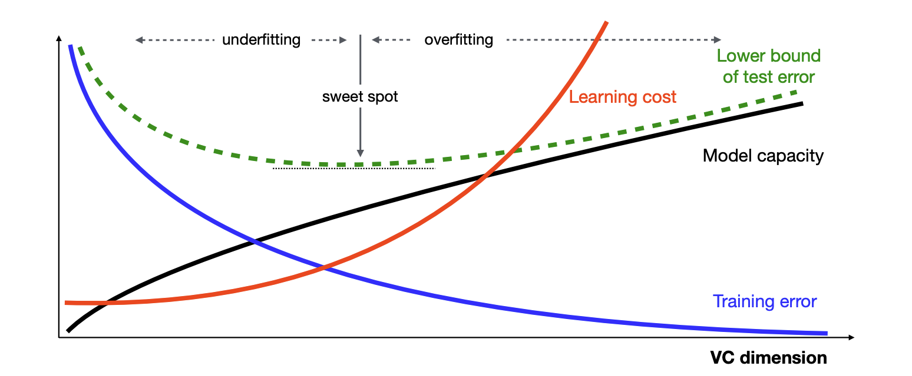

根据经典的Vapnik-Chervonenkis dimension (VC-dimension) 理论，如上图所示，随着模型的VC维度增加，模型的容量和复杂性增加，
训练误差逐渐减少。同时，对于高VC维度的复杂模型，测试误差先减少，达到一个和谐的“甜点”，然后呈现U形增加。除了借用的VC理论曲线外，
我们还增加了一条红色曲线表示学习成本。随着VC维度增加，模型变得更复杂，没有必要的参数调节，学习成本会急剧增加。

对于 RPN 模型，VC维度由数据扩展函数和参数调和函数决定，如果余项函数非零，也会有影响。这些组件共同影响模型的复杂性和学习能力。
通过数据扩展函数将数据实例投影到高维空间，我们增加了模型的表示复杂性。然而，参数调和函数通过在高维空间中减少数据实例的参数调和，
减轻了学习成本，并引导测试误差向最佳范围靠近。当然，在实际操作中，扩展和协调函数之间的完美平衡难以实现，可能导致学习误差和性能下降，
但余项函数可以弥补潜在的不足，提高 RPN 的鲁棒性。

### 生物神经科学角度

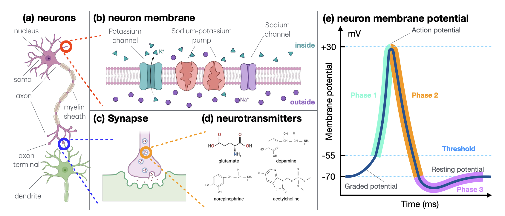

与其他现有神经模型（包括MLP和KAN及其衍生物）不同，RPN 从神经科学的角度提供了更准确的真实世界生物神经元建模。
大多数读者对神经科学支持人工神经元和神经网络模型设计的基本背景知识有一定了解，但为了帮助读者更好地理解 RPN 模型，
我们在文章中也简要描述生物神经元的结构和工作机制，如上图所示。

生物神经元的工作机制实际上启发了 RPN 模型的当前设计。其中，数据扩展函数通过将神经元的细胞状态投射到高维空间来建模，而不是原始空间。
这种方法使我们能够建模复杂状态，包括神经元的尖峰曲线，而不仅仅是简单的二进制0/1状态或在[0, 1]范围内的整数。
参数调和函数调整参数以适应神经元的高维状态，促进信号传输到连接的神经元。这模拟了在形成突触时神经递质-配体门控离子通道的制造。
此外，余项函数允许跳层数据投射，反映了生物神经元的广泛连接，从而实现更快的信号传输。

## RPN讨论：优点，局限性，以及后续工作

### RPN 优点

* **理论优点**：RPN模型将数据与参数解耦，并根据泰勒定理将几种机器学习和深度学习基础模型架构形式化为扩展数据实例与调和参数的内积。
从机器学习理论的角度来看，数据扩展函数负责将输入数据向量从一个基础空间投影到另一个空间；参数调和函数则会适应参数维度并根据VC理论对其进行正则化以避免过拟合。
同时，从生物神经科学的角度来看，数据扩展函数模拟了神经元在激活前、激活期间和激活后的复杂状态；参数调和函数制造神经递质及其配体门控离子通道以组成突触。 
RPN 模型架构使得从理论机器学习和生物神经科学的角度更容易解释结果和学习过程的物理意义。

* **技术优点**：RPN 模型为经典机器学习模型和一系列深度模型提供了一个统一的表示框架。
我们用非深度机器学习模型（如SVM和概率模型，包括朴素贝叶斯、贝叶斯网络和马尔可夫网络）和深度模型（如MLP和KAN）作为示例，
说明它们如何用 RPN 表示。此外，RPN 的多层、多头和多通道设计为未来模型设计和部署在各种应用中的灵活性提供了显著的支持。
RPN中的统一表示大大简化了未来机器学习、深度学习和人工智能模型与系统的设计与开发。

* **计算优点**：RPN在每一层中将数据与参数解耦允许它们的计算分别路由到不同的芯片、机器和云平台，保护数据隐私和模型参数安全。
此外，RPN依赖内积计算便于在各种计算平台、系统和硬件上进行并行化。RPN模型可以用传统的误差反向传播有效训练。
梯度计算和参数更新可以在不同计算设施之间最小化消息传递地局部执行，使得 RPN 在现实世界大规模系统和模型中部署时显著减少计算资源和能源消耗。

### RPN 局限性和后续工作主要方向

* **建模局限性**：尽管我们旨在用RPN统一现有的机器和深度学习基础模型，但仍有大量模型我们尚未覆盖或调查如何用RPN表示。
例子包括树家族模型（如决策树、梯度提升树和随机森林）、集成学习模型（如bagging、boosting和stacking模型）、无监督学习模型（如k-means、主成分分析）和强化学习模型（如q-learning、策略梯度方法）。
许多这些模型可以用RPN表示；例如，决策树可以用条件概率解释，集成学习模型可以用RPN的多头多通道机制建模。然而，我们将这些模型的探索留待未来的研究。

* **效率局限性**：RPN中的数据扩展函数将数据实例扩展到更高维度以更好地逼近目标函数。虽然我们可以利用深层架构在每一层约束扩展空间的维度，
但数据实例的中间表示仍可能消耗大量计算资源，并且深层架构可能引入更高的计算时间开销。例如，如果我们计划用RPN构建具有更长上下文宽度的语言模型，
某些扩展函数（如组合扩展和那些用克罗内克积定义的）可能不适用。此外，在设计数据扩展函数、参数调和函数和余项函数时，
我们没有考虑任何优化高性能计算系统性能的技术，这可能潜在地解决效率问题。我们打算在未来的工作中研究这些领域。

* **学习局限性**：本文中的RPN模型训练仍依赖误差反向传播算法，近年来该算法因其高计算成本、收敛缓慢以及对超参数和初始化的敏感性而受到批评。
此外，更高维度的扩展可能导致输入数据实例的输出更宽，可能引发过拟合和性能鲁棒性问题。然而，在每一层将参数从数据解耦到不同函数提供了探索新模型训练算法的机会，
本文未讨论这一点。我们认为设计RPN的新学习算法是未来研究的重要方向之一。

## 结论

在本文中，我们介绍了 Reconciled Polynomial Network（RPN）作为一种用于深度函数学习任务的新型基础模型。通过引入多层、多头和多通道，RPN具备灵活的模型架构，
并在各种多模态数据上的多样化深度函数学习任务中表现出优越的建模能力。此外，通过特定选择的组成函数——包括数据扩展、参数调和，以及余项函数，
RPN提供了一个将几种有影响力的基础模型统一到一个标准表示中的框架。为了展示RPN的有效性，本文在众多基准数据集上进行了广泛的实证实验，用于各种深度函数学习任务。
结果一致表明，RPN相较于其他基础模型表现出卓越的性能。

为了促进RPN的采用、实施和实验，本文发布了一个名为`tinybig`的综合工具包。`tinybig`工具包提供了本文介绍的预实现组成函数的丰富库，
允许研究人员快速设计、定制和有效部署RPN模型用于各种学习任务。

## `tinybig`工具包和网站介绍

### github 源码和 PyPI 项目页面

`tinybig` 提供了一个丰富的预实现函数库，包括25类数据扩展函数、10类参数调和函数和5类余项函数，以及完整的模型框架和优化的模型训练管道。
这个集成工具包使研究人员能够快速设计、定制和部署 RPN 模型，覆盖广泛的深度函数学习任务。

关于 `tinybig` 的具体信息，欢迎查看官方网站和项目在github的主页。

* **Github Repository**: [https://github.com/jwzhanggy/tinyBIG](https://github.com/jwzhanggy/tinyBIG)
* **PyPI Package**: [https://pypi.org/project/tinybig/](https://pypi.org/project/tinybig/)

### 项目网站

除此之外，我们还问这个项目搭建了完整的项目网站，网站中包含了完整的项目文档，代码示例，和入门教程。
网站链接和部分网站页面如下所示：

* **Official Website**: [https://www.tinybig.org/](https://www.tinybig.org/)

#### 网站主页

#### 文档目录

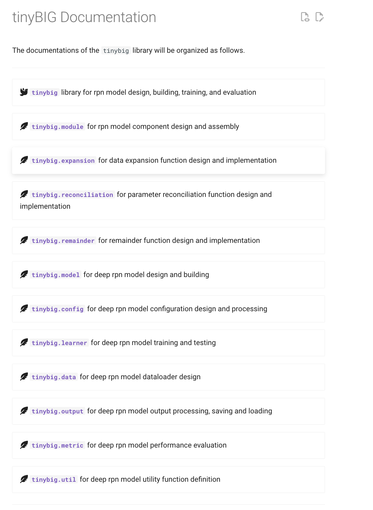

#### Tutorial 列表

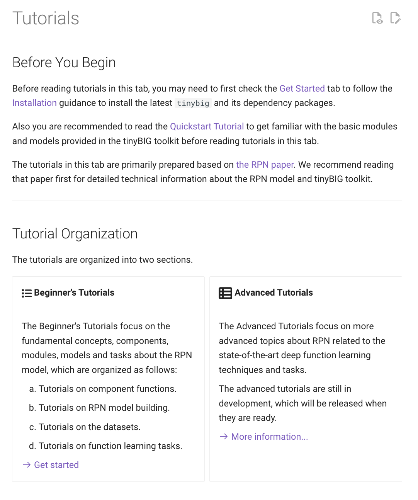

#### 代码示例列表

