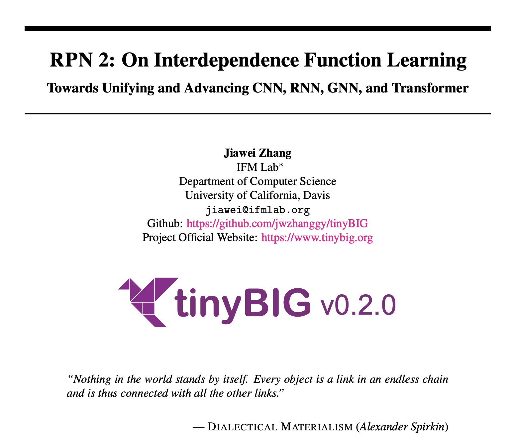

---------------
# 大一统 2.0！CNN, RNN, GNN 和 Transformer 模型的统一表示和泛化误差理论分析

## 文章标题

### RPN 2: On Interdependence Function Learning Towards Unifying and Advancing CNN, RNN, GNN, and Transformer

## 文章, 网站, 和源码链接

* **RPN 2 Paper**: [https://arxiv.org/abs/2411.11162](https://arxiv.org/abs/2411.11162)
* **Official Website**: [https://www.tinybig.org/](https://www.tinybig.org/)
* **Github Repository**: [https://github.com/jwzhanggy/tinyBIG](https://github.com/jwzhanggy/tinyBIG)
* **PyPI Package**: [https://pypi.org/project/tinybig/](https://pypi.org/project/tinybig/)

## 背景介绍

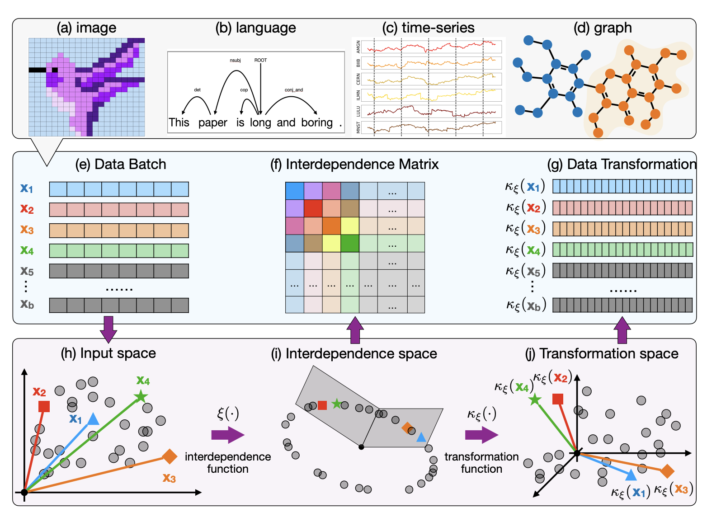

本文是基于我们之前的 [RPN (Reconciled Polynomial Network)](https://arxiv.org/abs/2407.04819) 研究的后续工作。
在此前的研究中，我们提出了RPN这一通用模型架构，其包含三个组件函数：数据扩展函数、参数调和函数和剩余函数。
我们先前的研究表明，RPN在构建不同复杂性、容量和完整性水平的模型方面具有很强的通用性，同时可以作为统一多种基础模型（包括PGM、核SVM、MLP和KAN）的框架。

然而，先前的RPN模型基于以下假设：训练批次中的数据实例是独立同分布的。此外，在每个数据实例内部，RPN还假定所涉及的数据特征彼此独立，并在扩展函数中分别处理这些数据特征。
不过，现实数据往往存在比较强的相互依赖关系，这种依赖关系既存在于样本之间，也存在样本内部各个数据特征之间。 
如上图中 (a)-(d) 所示， 对于图像、语言、时间序列和图等复杂且具有相互依赖的数据，这使得先前 RPN 模型的独立假设不成立。
如果像先前的RPN模型那样忽略这些数据的相互依赖性，学习性能将显著下降。

## RPN 2 模型结构

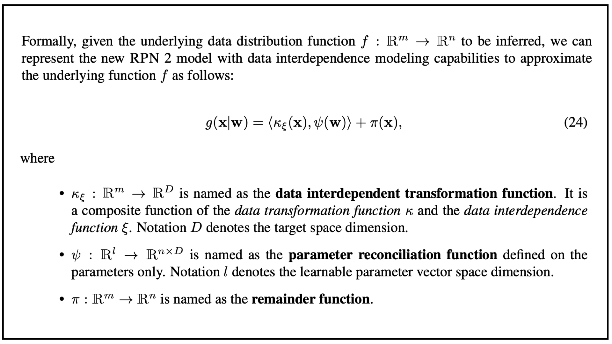

为了解决上面提到的问题，在本文中，我们重新设计了RPN架构，提出了新的 **RPN 2**（即**Reconciled Polynomial Network 2.0**）模型。
如上图中所示，RPN 2 引入了一个全新的组件——数据依赖函数，用于显式建模数据实例和数据特征之间的多种依赖关系。
这里需要解释一下，虽然我们在本文中将该组件称为 “**依赖函数（interdependence function）**”，但实际上，该函数捕获了输入数据中的多种关系，
包括结构性依赖、逻辑因果关系、统计相关性以及数值相似性或差异性等。

在模型架构方面，如上图所示，**RPN 2** 由四个组成函数构成：**数据扩展函数(data expansion function）**、**数据依赖函数（data interdependence function）**, 
**参数调和函数(parameter reconciliation function)**、和**余项函数(remainder function)**。

* **数据扩展函数**：根据数据扩展函数的定义，RPN 2 将数据向量从输入空间投射到中间隐层（更高维度）空间，投射后的数据将由新空间中的新的基向量表示。
* **数据依赖函数**：根据数据和底层模态结构信息，RPN 2将数据投射到依赖函数空间，投射后的数据分布能够有效地获取数据样本和特征之间的相互依赖关系。
* **参数调和函数**：为了应对数据扩展带来的“维度灾难”问题，RPN 2 中的参数调和函数将一组减少的参数合成为一个高阶参数矩阵。 这些扩展的数据向量通过与这些生成的调和参数的内积进行多项式集成，从而将这些扩展的数据向量投射回所需的低维输出空间。
* **余项函数**：此外，余数函数为RPN 2 提供了额外的补充信息，以进一步减少潜在的近似误差。

## RPN 2 深度和广度的模型结构

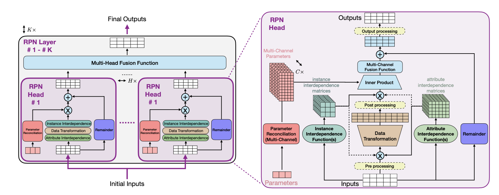

RPN 2 提供了灵活的模型设计和结构，并且允许用户搭建不同深度和广度的模型结构。
上图展示了 RPN 2 的多层（K层）架构，每一层包含多个头部（multi-head）用于函数学习，这些头部的输出将被融合在一起。
右侧子图展示了 RPN 2 头部的详细架构，包括数据变换函数、多通道参数调和函数、余项函数及其内部操作。
属性和实例的相互依赖函数会计算相互依赖矩阵，该矩阵将应用于输入数据批次，位置可以是在数据变换函数之前或之后。
虚线框内黄色圆角矩形表示可选的数据处理函数（例如激活函数和归一化函数），这些函数可作用于输入、扩展以及输出数据。

## 多模态数据底层结构和依赖函数

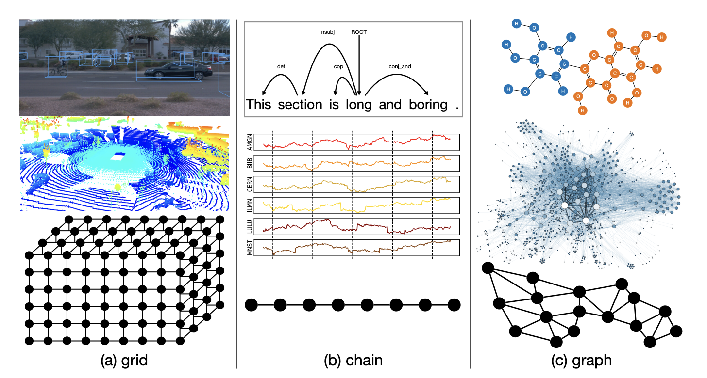

本文还专门分析了几种常见数据的底层模态结构，包括图像、点云、语言、时序、和各类图结构数据。 如下图所示：

* 图像和点云表示为网格结构数据，其中节点表示像素和体素，连边表示空间位置关系；

* 语言和时间序列数据表示为链式结构数据，其中节点表示词元和数值，连边表示顺序关系；

* 分子化合物和在线社交网络表示为图结构数据，其中节点表示原子和用户，连边表示化学键和社交连接。

### 图像和点云数据几何依赖函数

对于图像和点云，每个 pixel （或者 voxel）之间的依赖关系往往存在于图像和点云数据的局部。
换而言之，我们可以从输入的图像和点云数据中划分出局部的 patch 结构，用来描述 pixel 和 voxel 之间的依赖范围。
在传统模型中，这种 patch 的形状往往需要认为定义，其形状可以是 **cuboid shape**， **cylinder shape**，**sphere shape**。

而从 grid 中定义 pixel （或者 voxel）依赖范围的过程可以表示为 patch packing 这一经典几何学问题。
取决于 patch 的形状，本文提出了多中 packing 的策略用来定义依赖函数，以平衡获取输入数据信息的完整度和避免数据冗余。

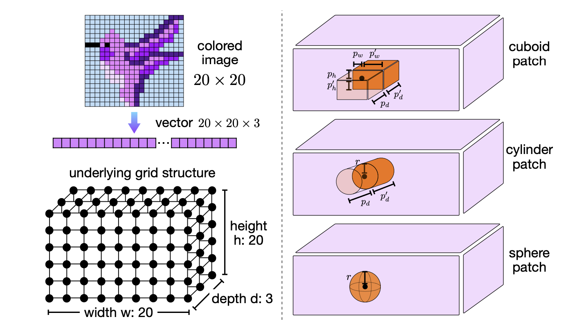

### 语言和时序数据拓扑依赖函数

除了基于 grid 的几何依赖函数之外，本文还介绍了基于 chain 和 graph 的拓扑依赖函数。
链式结构依赖函数和多跳链式依赖函数主要用于建模数据中的顺序依赖关系，这种关系广泛存在于自然语言、基因序列、音频记录和股票价格等数据中。
基于序列数据，本文定义了多种基于 chain 结构的拓扑 single-hop 和 multi-hop 的依赖函数。

其中 single-hop chain 结构的拓扑依赖函数分为单向和双向两种。如下图所示，单向依赖强调元素仅依赖于前一个，而双向依赖则考虑元素同时依赖于前后邻居，从而捕捉更全面的上下文信息。
为了高效建模长链数据中的多跳依赖关系，multi-hop chain 结构的拓扑依赖函数引入了跳数（hop）参数，直接描述链中某一元素与多跳范围内其他元素的信息交互。
同时，通过累积多跳函数聚合多个跳数的信息，进一步扩展了特征捕获范围。

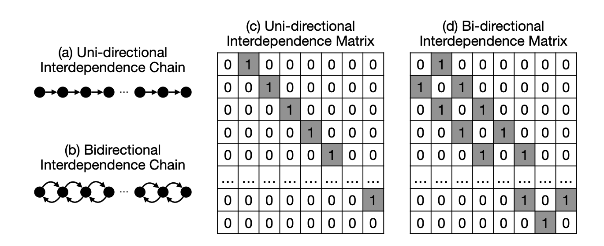

### 图结构数据拓扑依赖函数

不仅如此，入下图所示，本文还提出了基于 graph 结构的拓扑依赖函数。
图结构依赖函数和基于 PageRank 的图结构依赖函数旨在建模复杂数据之间的广泛依赖关系，特别是以图为基础的数据，如社交网络、基因互动网络等。
在图结构依赖函数中，数据的依赖关系被表示为一个图 G=(V,E)，其中节点表示属性或数据实例，边表示它们之间的依赖关系，对应的依赖矩阵 A 则是图的邻接矩阵。
基于该图结构，函数通过矩阵运算建模节点之间的多跳依赖关系，并引入累积多跳函数以整合多层次的信息交互。进一步地，基于 PageRank 的图依赖函数利用图的随机游走思想，
通过收敛矩阵高效地建模全局的长距离依赖关系，并支持多种矩阵归一化策略以增强计算的稳定性和灵活性。

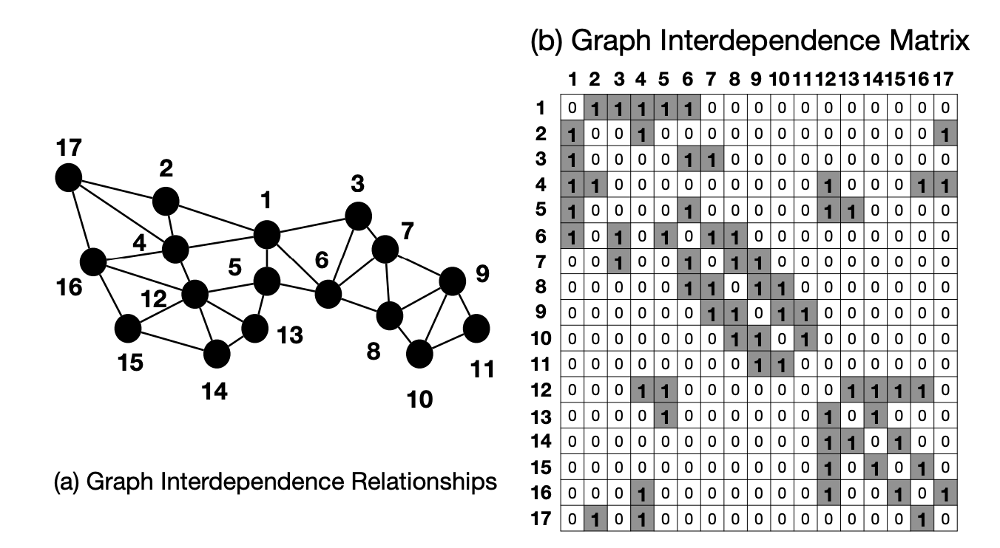

## RPN 2 依赖函数列表

除了上述提到的依赖函数之外，本文还提出了多中依赖函数用来建模多种类型数据之间的依赖关系。
通过有效地使用这些依赖函数和其他函数，我们可以构建更加有效的模型架构，使RPN 2 能够应对广泛的学习挑战。

在本文中，我们总共提出了9大类，50多种的数据依赖函数，部分依赖函数的表示和基本信息都总结在了上面的列表中。

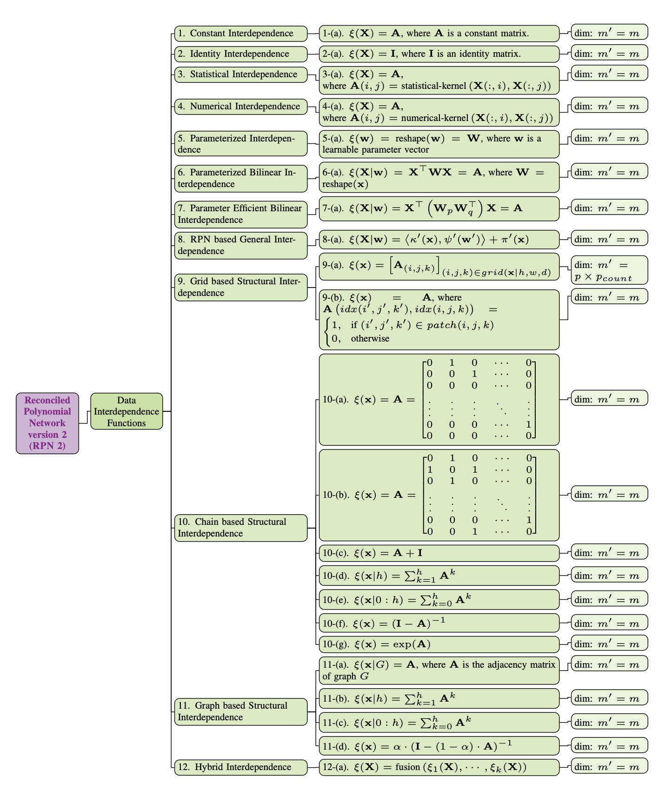

## 深度学习模型的统一表示：CNN, RNN, GNN 和 Transformer

RPN实现了丰富的功能函数，具体列表如上图所示。 通过组合使用上述功能函数，RPN 2 不仅可以构建功能强大的模型结构， 
并且可以统一现有基础模型的表示，包括 CNN，RNN，GNN 和 Transformer 模型。

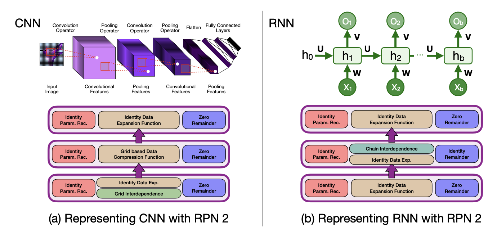

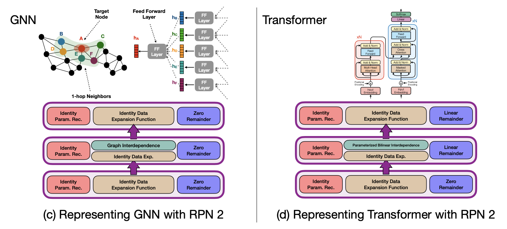

## 实验验证

为了验证提出的 RPN 2 模型的有效性，本文通过大量的实验结果和分析，证明了 RPN 2 在多种 Function Learning Task上的有效性。 

在本文中，具体的实验任务包括：离散图片和文本分类，时序数据预测，和图结构数据学习等。

### 离散图片和文本分类

在本文中，我们在离散图片和文本数据集上测试了 RPN 2 的实验效果，包括

* MNIST 图片数据集
* CIFAR10 图片数据集
* IMDB 文本数据集
* SST2 文本数据集
* AGNews 文本数据集

我们不仅跟先前的 RPN 1 模型进行了对比，也和传统的 MLP 和 CNN/RNN 模型进行了对比，具体结果如下表所示：

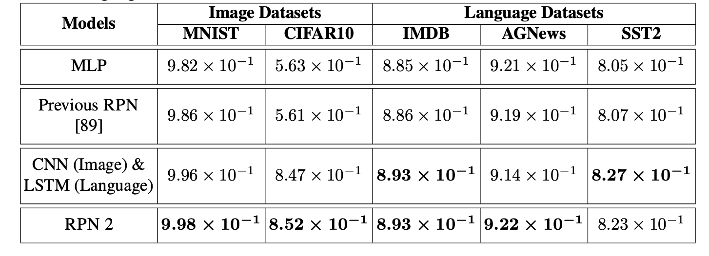

**Note**: 本文实验所使用的数据集，都没有使用基于 flipping, rotation 等技术进行数据增强。上表展示了各个方法在多个数据集上分类的 Accuracy score。

### 图片数据依赖扩展

对于图片数据，RPN 2 使用了基于 cylinder patch shape 的依赖函数。
下图也展示了部分图片基于 RPN 2 所学得的数据表示，其中图片中的每个 pixel 都被扩展成了一个 cylinder patch shape，
每个 cylinder patch 包含了每个 pixel 周围的有效的 context 信息。

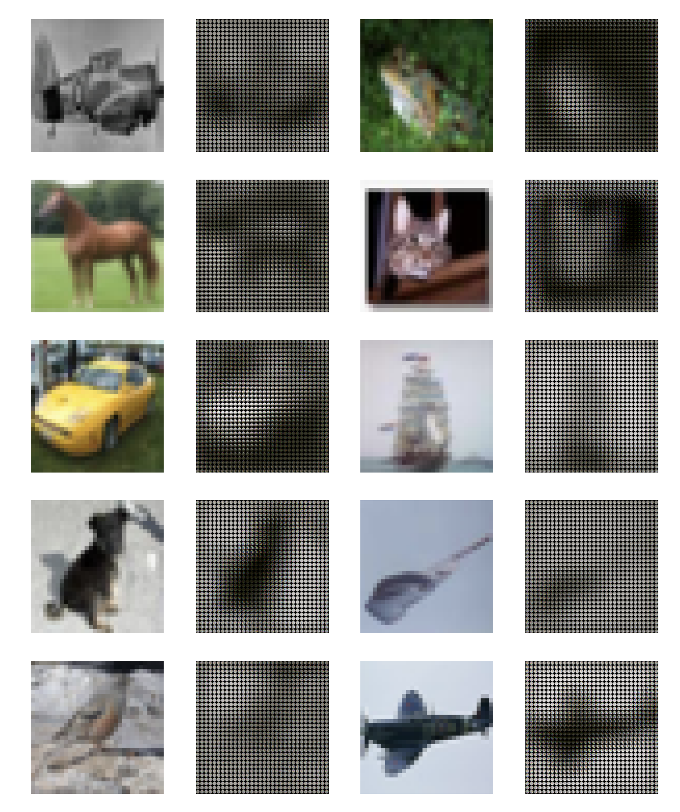

### 时序数据预测

RPN 2 也可以有效地拟合时序数据，本文使用了四个时序数据集来验证 RPN 2 在时序数据拟合和预测的有效性，包括：

* **Stock market dataset**
* **ETF market dataset**
* **LA traffic record**
* **Bay traffic record**

如下表所示，通过使用 chain 结构的依赖函数，RPN 2 可以有效的获取时序数据之间的依赖关系，并且在各个数据集上都获得有效的学习结果。

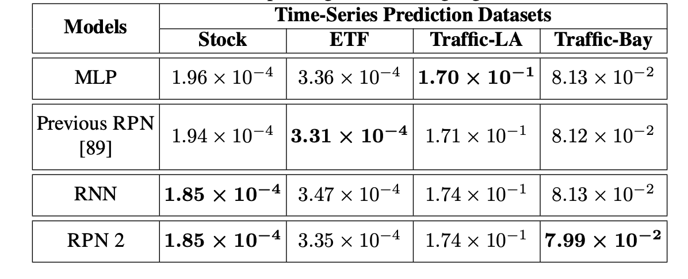

**Note**: 上表中的结果是各个方法在几个时序数据集上预测结果的 MSE。

## 图结构数据学习

为了验证 RPN 2 在图结构数据上的有效性，本文也提供了各个方法在 graph 结构数据上的学习结果，包括：

* **Cora graph**
* **Citeseer graph**
* **Pubmed graph**

入下表所示，基于 graph 依赖函数和复合依赖函数（包括 graph 和 bilinear 依赖函数），RPN 2 在多个 graph 数据集上都可以获得比 GCN 都优的节点分类的结果。

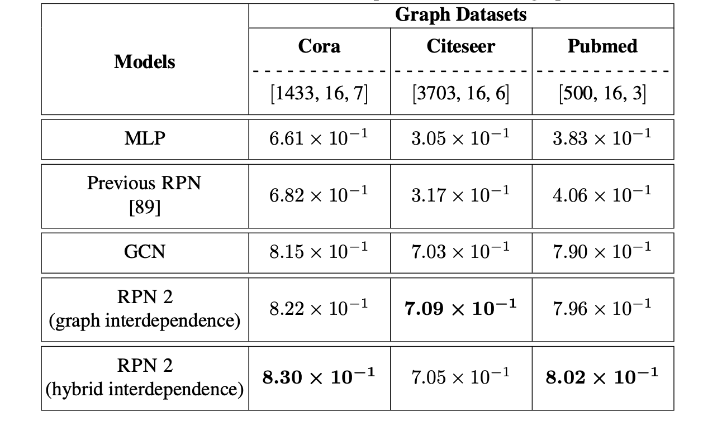

**Note**: 上表中的结果是各个方法在几个graph数据集上 node 分类结果的 Accuracy。

## 基于 RPN 2 的模型泛化误差分析

除了实验验证之外， 本文还提供了基于 RPN 2 的模型泛化误差的理论分析，其分析结果对目前主流的深度模型（例如 CNN, RNN, GNN 和 Transformer）都适用。

本文的模型泛化误差是基于给定的数据集 D 来进行分析，其中 D 的一部分可以作为训练集用来进行模型训练，我们可以定义模型产生的误差项如下图所示：

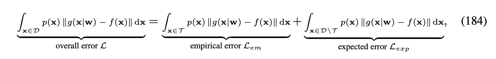

本文中，模型泛化误差是指 L_{exp} - L_{em}，即模型在未见到的数据样本上所产生的误差和在训练数据样本上产生的误差的差别：

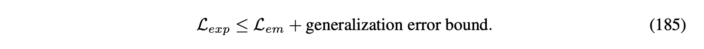

### 基于 VC-Dimension 泛化误差分析

基于 RPN 2 的模型结构，我们定义了模型的 VC-Dimension 如下图所示：

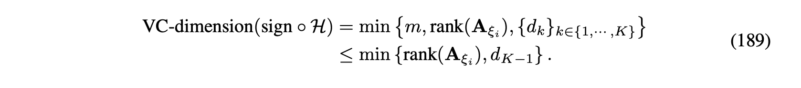

根据所获得的 VC-Dimension 我们定义了 RPN 2 模型的泛化误差如下图所示：

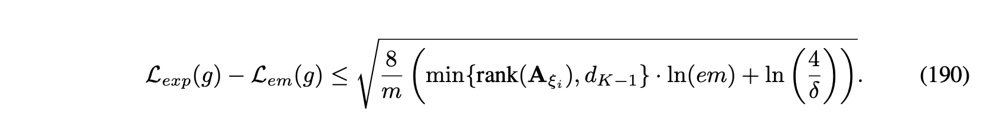

### 基于 Rademacher Complexity 泛化误差分析

除了 VC-dimension 之外，我们还基于 Rademacher Complexity 理论分析了模型的泛化误差。
相比 VC-dimension，Rademacher Complexity 不仅仅考虑了 RPN 2 模型结构，还考虑了输入数据对泛化误差的影响。

基于提供的 RPN 2 模型，我们定义了模型 Rademacher Complexity 如下图所示：

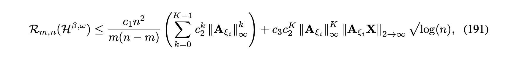

根据定义的 Rademacher Complexity，我们进一步分析了 RPN 2 泛化误差如下图所示：

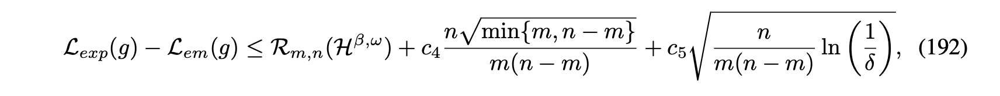

上述模型泛化误差分析不仅仅可以从理论上解释现有模型表现的区别，也为将来模型的设计提供了一下启示，特别是针对依赖函数的设计。

## RPN 2 讨论：优点，局限性，以及后续工作

### RPN 2 优点

本文通过引入建模属性和实例间关系的数据依赖函数，对RPN 2模型架构进行了重新设计。基于实验结果和理论分析，所提出的依赖函数显著提升了RPN 2模型在处理复杂依赖数据时的学习能力，具体贡献包括以下三方面：

* **理论贡献**: 与假设数据独立同分布的旧版模型不同，新设计的RPN 2模型通过一组基于输入数据批次的依赖函数，能够有效捕捉属性与实例之间的依赖关系，从而大幅扩展模型的建模能力。此外，本文提供的理论分析（基于VC维和Rademacher复杂度）展示了如何定义最优依赖函数以减少泛化误差。这些依赖函数还从生物神经科学角度模拟了神经系统的某些补偿功能，为功能学习任务提供新的启发。

* **技术贡献**: RPN 2模型引入了一组多样化的依赖函数，从多个维度（包括输入数据批次、拓扑与几何结构等）捕捉属性和实例间的关系。这些函数实现了对多种主流模型（如CNN、RNN、GNN和Transformer）的统一建模，并揭示它们的架构相似性——关键差异在于依赖函数的定义方式。这些发现为设计下一代“Transformer-Next”骨干模型提供了重要的理论指导。

* **计算贡献**: 引入的依赖函数生成用于建模实例和属性关系的依赖矩阵。这些矩阵通常规模较小且稀疏，占用存储资源有限。此外，依赖函数在数据变换之前操作于原始数据批次，从而显著减少了计算开销。与旧版模型类似，RPN 2模型的架构支持将不同函数分布在多台设备或云平台上计算，从而提升学习效率，同时保障数据隐私和模型参数安全。

### RPN 2 局限性

在实现RPN 2架构及其组件模块的过程中，我们发现了一些局限性，主要体现在动态数据建模能力、学习算法适配性以及大规模智能系统的潜在部署方面。

* **学习局限性**: RPN 2模型在适配损失函数、优化器和基于误差反向传播的学习算法方面面临一定挑战。尽管传统的表征学习损失函数和优化方法适用于当前的函数学习任务，但它们与以函数为导向的学习模型存在一定不一致性。RPN 2模型需要通过基于感知机的层（如身份数据变换、身份融合、零余项函数）将输入数据压缩至输出空间。尽管这些层对传统表征学习模型是必要的，但在函数学习模型中，它们仅进行最小的数据变换，显著降低了数据压缩后的表示能力。

* **建模局限性**: 本文虽然成功将多种主流骨干模型统一于RPN 2的范式中，但在表示RNN模型时仍面临挑战。当前模型缺乏动态处理能力，需要将RNN的时间依赖转换为空间依赖，这限制了RPN 2对“时间动态”的建模能力。这是构建具备空间智能的未来世界模型的关键因素之一。为此，我们计划重新设计RPN 2中的模块，使其能够支持“时间动态”建模，这也将成为未来研究的重点方向。

* **大规模智能系统**: 为了验证所提技术的有效性，我们计划基于RPN 2构建一个大规模智能系统，以展示其多模态建模能力、学习性能优势以及高效的参数使用。然而，创建此类系统需要重新设计许多组件函数和模型，以确保在处理大规模数据和海量参数时的学习效率。一旦解决上述学习和建模方面的局限性，我们将启动这一大规模智能系统项目，并与当前基于RPN 2的骨干框架项目并行开发。

### RPN 2 后续工作

在即将到来的2025年，我们计划着力解决RPN 2模型和tinyBIG库的当前局限性，重点放在完善RPN 2模型框架以及开发利用增强版RPN 2模型和tinyBIG工具库的应用项目。

* **框架增强项目**: 按照目前的开发进度，我们预计将用六个月的时间解决RPN 2模型在学习方面的局限性，具体包括探索面向函数学习的损失函数、优化目标函数以及模型学习算法。一个包含这些学习优化功能的新版本RPN 2预计将在2025年年中发布。此外，我们计划将“时间”及相关功能引入RPN 2模型，从而支持动态学习场景。对“时间动态”的建模将需要对现有功能和组件进行大幅度重新设计，这将是一个耗时的过程。在完成学习局限性的解决后，我们预计还需六个月将“时间动态”整合到模型架构中，目标是在2025年底发布支持该功能的版本。

* **应用项目**: 在解决学习和建模挑战的同时，我们计划启动多个系统构建项目，对RPN 2在包含一种或多种模态的大规模数据集上的表现进行初步测试。预计到2025年底，我们将启动一个大规模智能系统项目。由于该项目的复杂性和预期的挑战，其开发可能需要数年时间。随着RPN 2和智能系统项目的推进，我们将定期发布技术报告，分享最新进展和成果。

## 结论

本文重新设计了调和多项式网络（Reconciled Polynomial Network），引入了新模型RPN 2，其核心创新是数据依赖函数，用于显式建模数据实例和属性之间的多样化关系。这些函数显著提升了RPN 2在图像、语言、时间序列和图数据等复杂任务中的学习能力。在多模态基准数据集上的实验表明，RPN 2在深度函数学习任务中始终优于现有的骨干模型。此外，RPN 2扩展了其统一潜力，将CNN、RNN、GNN和Transformer等主流架构纳入其范式，同时为设计下一代“Transformer-Next”模型提供了新的见解。本文还从理论机器学习和生物神经科学的角度对RPN 2进行了深入解析，并更新了工具库tinyBIG，支持研究者高效设计和部署基于RPN 2的模型，推动依赖建模在多样化任务中的应用。

## `tinybig v0.2.0`工具包和网站介绍

此外，为了促进新 RPN 2 的采用、实现和实验，我们更新了先前论文中提出的 tinybig 工具包至新版本`tinybig v0.2.0`。
这一更新版本在 RPN 2 的模型设计和学习中引入了相互依赖建模能力，更新了 model head 和 layer 模块以及 RPN 2 的模型架构。

### github 源码和 PyPI 项目页面

此外，`tinybig v0.2.0`还引入了一组新的数据压缩和多输入函数，用于将数据向量嵌入到低维空间中。
RPN 2 还更新了现有的数据扩展和参数调和函数库，以便更好地支持基于 RPN 2 模型的实现。
该更新的工具包使研究人员能够快速设计、定制和部署新的 RPN 2 模型，适用于各种相互依赖数据集上的广泛功能学习任务。

关于 `tinybig v0.2.0` 的具体信息，欢迎查看官方网站和项目在github的主页。

* **Github Repository**: [https://github.com/jwzhanggy/tinyBIG](https://github.com/jwzhanggy/tinyBIG)
* **PyPI Package**: [https://pypi.org/project/tinybig/](https://pypi.org/project/tinybig/)

### 项目网站

除此之外，我们还问这个项目搭建了完整的项目网站，网站中包含了完整的项目文档，代码示例，和入门教程。
网站链接和部分网站页面如下所示：

* **Official Website**: [https://www.tinybig.org/](https://www.tinybig.org/)

