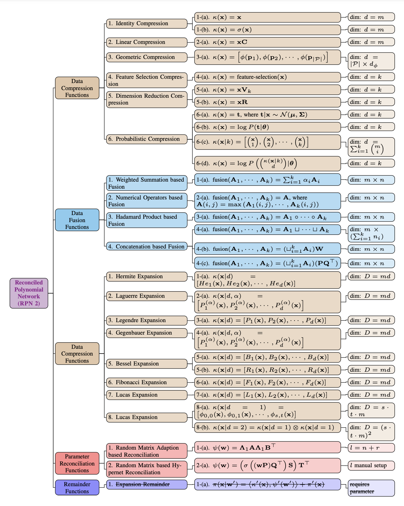

---------------
# 大一统 2.0！CNN, RNN, GNN 和 Transformer 的统一表示和模型泛化理论分析

## 文章标题

### RPN 2: On Interdependence Function Learning Towards Unifying and Advancing CNN, RNN, GNN, and Transformer

## 文章, 网站, 和源码链接

* **RPN Paper**: [https://arxiv.org/abs/2411.11162](https://arxiv.org/abs/2411.11162)
* **Official Website**: [https://www.tinybig.org/](https://www.tinybig.org/)
* **Github Repository**: [https://github.com/jwzhanggy/tinyBIG](https://github.com/jwzhanggy/tinyBIG)
* **PyPI Package**: [https://pypi.org/project/tinybig/](https://pypi.org/project/tinybig/)

## 背景介绍

本文是基于我们之前的 [RPN (Reconciled Polynomial Network)](https://arxiv.org/abs/2407.04819) 研究的后续工作。
在此前的研究中，我们提出了RPN这一通用模型架构，其包含三个组件函数：数据扩展函数、参数调和函数和剩余函数。
我们先前的研究表明，RPN在构建不同复杂性、容量和完整性水平的模型方面具有很强的通用性，同时可以作为统一多种基础模型（包括PGM、核SVM、MLP和KAN）的框架。

然而，先前的RPN模型基于以下假设：训练批次中的数据实例是独立同分布的。此外，在每个数据实例内部，RPN还假定所涉及的属性彼此独立，并在扩展函数中分别处理这些属性。
然而，如上图中 (a)-(d) 所示，对于图像、语言、时间序列和图等复杂且具有相互依赖的数据，这些假设通常并不成立。
在这类数据中，数据实例之间以及属性之间通常存在强相互依赖关系。如果像先前的RPN模型那样忽略这些数据的相互依赖性，学习性能将显著下降。

## RPN 2 模型结构

在本文中，我们重新设计了RPN架构，提出了新的RPN 2（即Reconciled Polynomial Network 2.0）模型。
如图1所示，RPN 2 引入了一个全新的组件——相互依赖函数，用于显式建模数据实例和属性之间的多种关系。
虽然我们将该组件称为 “相互依赖（interdependence）”，但实际上，该函数捕获了输入数据中的多种关系，
包括结构性依赖、逻辑因果关系、统计相关性以及数值相似性或差异性等。

上图展示了 RPN 2 的多层（K层）架构，每一层包含多个头部（multi-head）用于函数学习，这些头部的输出将被融合在一起。
右侧子图展示了 RPN 2 头部的详细架构，包括数据变换函数、多通道参数调和函数、余项函数及其内部操作。
属性和实例的相互依赖函数会计算相互依赖矩阵，该矩阵将应用于输入数据批次，位置可以是在数据变换函数之前或之后。
虚线框内黄色圆角矩形表示可选的数据处理函数（例如激活函数和归一化函数），这些函数可作用于输入、扩展以及输出数据。

## 多模态数据底层结构

本文还专门分析了几种常见数据的底层模态结构，包括图片、点云、语言、时序、和各类图结构数据。 如下图所示：

* 图像和点云表示为网格结构数据，其中节点表示像素和体素，连边表示空间关系；
* 
* 语言和时间序列数据表示为链式结构数据，其中节点表示词元和数值，连边表示顺序关系；
* 
* 分子化合物和在线社交网络表示为图结构数据，其中节点表示原子和用户，连边表示化学键和社交连接。

## 多模态数据依赖函数

## RPN 2 依赖函数列表

## RPN 2 其他函数列表

## 深度学习模型的统一表示：CNN, RNN, GNN 和 Transformer

## 实验验证

### 离散数据分类

### 图片数据依赖扩展

### 时序数据预测

## 图结构数据学习

## RPN 2 依赖函数的理论和生物学解释和动机

### 机器学习理论解释

### 生物学解释

## RPN 2 讨论：优点，局限性，以及后续工作

### RPN 2 优点

### RPN 2 局限性

### RPN 2 后续工作

## 结论

## `tinybig v0.2.0`工具包和网站介绍

此外，为了促进新 RPN 2 的采用、实现和实验，我们更新了先前论文中提出的 tinybig 工具包至新版本`tinybig v0.2.0`。
这一更新版本在 RPN 2 的模型设计和学习中引入了相互依赖建模能力，更新了 model head 和 layer 模块以及 RPN 2 的模型架构。

### github 源码和 PyPI 项目页面

此外，`tinybig v0.2.0`还引入了一组新的数据压缩和多输入函数，用于将数据向量嵌入到低维空间中。
RPN 2 还更新了现有的数据扩展和参数调和函数库，以便更好地支持基于 RPN 2 模型的实现。
该更新的工具包使研究人员能够快速设计、定制和部署新的 RPN 2 模型，适用于各种相互依赖数据集上的广泛功能学习任务。

关于 `tinybig v0.2.0` 的具体信息，欢迎查看官方网站和项目在github的主页。

* **Github Repository**: [https://github.com/jwzhanggy/tinyBIG](https://github.com/jwzhanggy/tinyBIG)
* **PyPI Package**: [https://pypi.org/project/tinybig/](https://pypi.org/project/tinybig/)

### 项目网站

除此之外，我们还问这个项目搭建了完整的项目网站，网站中包含了完整的项目文档，代码示例，和入门教程。
网站链接和部分网站页面如下所示：

* **Official Website**: [https://www.tinybig.org/](https://www.tinybig.org/)

